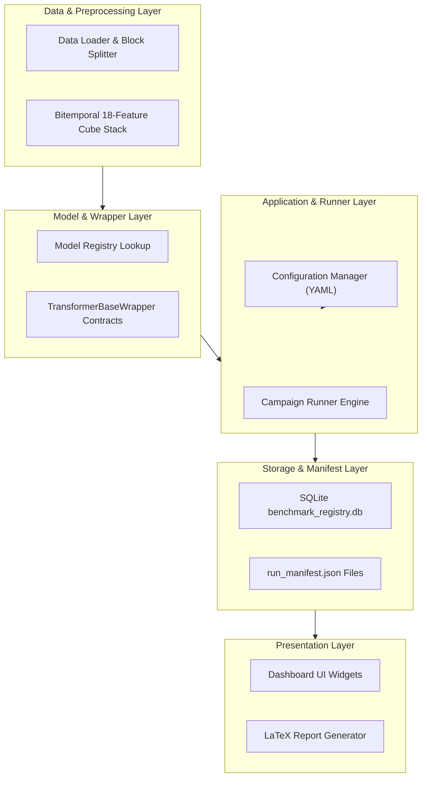
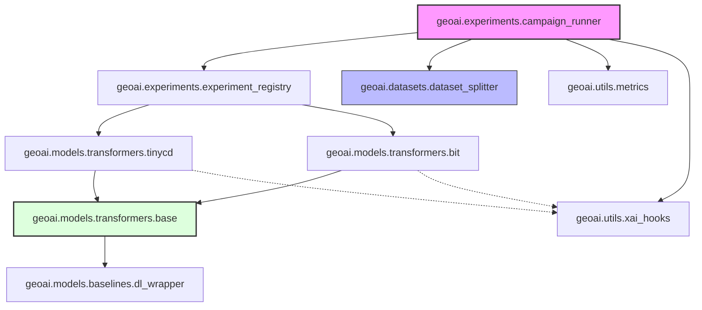
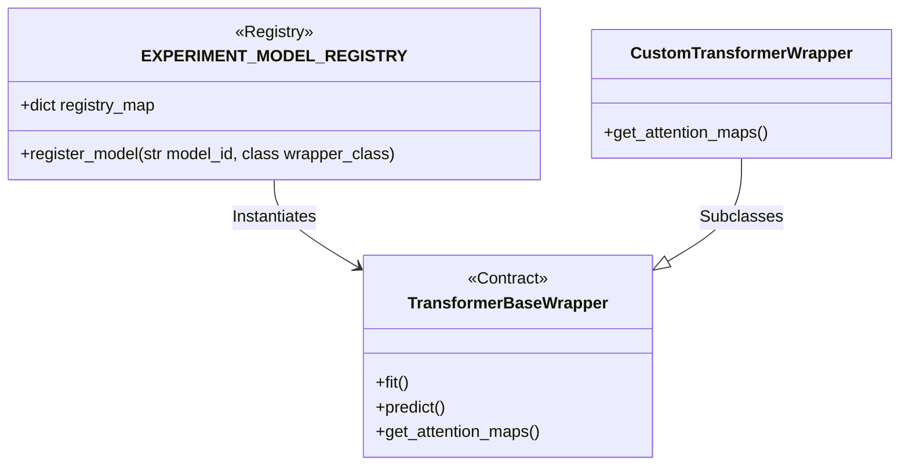
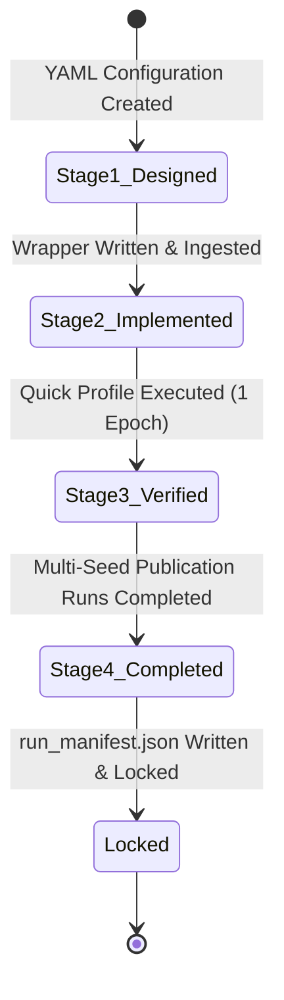
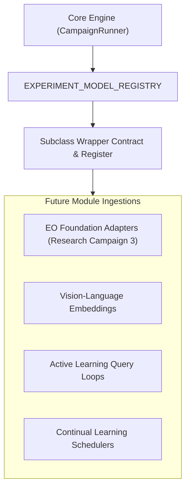
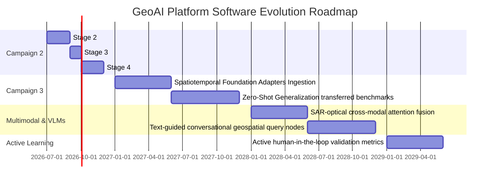

# Software Architecture Specification (SAS) v1.0
## GeoAI Research Platform

**Author:** GeoAI Technical Steering Committee  
**Maintainer:** Lead AI Architect / Antigravity Assistant  
**Date:** July 2, 2026  
**Document Status:** Version 1.0 Final Specification (Approved & Frozen)  

---

## Document Governance

[GEOAI ENGINEERING DECISION] The following governance record defines the maintenance, ownership, and approval authorities for this architecture specification.

| Governance Field | Value / Description |
| :--- | :--- |
| **Document Owner** | Technical Steering Committee, GeoAI Research Platform |
| **Approval Authority** | Principal Investigator & Steering Committee |
| **Review Frequency** | Bi-Annually |
| **Current Version** | Version 1.0 (Master Release) |
| **Last Reviewed** | July 2, 2026 |
| **Next Review Date** | January 2, 2027 |
| **Document Type** | Software Architecture Specification (SAS) |
| **Purpose** | Establish engineering and scientific boundaries for Research Campaign 2 and Research Campaign 3 |

---

## SECTION 1 — EXECUTIVE OVERVIEW

### 1.1 Platform Vision
The GeoAI Research Platform is a modular, extensible, and reproducible framework designed to benchmark, evaluate, and deploy deep learning models for remote sensing (RS) change detection (CD). It bridges the gap between raw scientific research and production-grade geospatial intelligence.

### 1.2 Engineering Goals
*   **Modularity:** Decouple data pipeline, model registry, execution wrapper, and dashboard visualization layers.
*   **Extensibility:** Provide plugin points for new architectures, datasets, and metrics without altering core engine scripts.
*   **Portability:** Support Windows-compatible local workstation benchmarking and CPU-only fallbacks while scaling to GPU clusters.
*   **Reproducibility:** Enforce programmatic seed locks, dataset hashes, and Git metadata tracking.

### 1.3 Scientific Goals
*   **Explainability (XAI):** Expose query-key attention matrices and token projections to evaluate features semantically.
*   **Geographic Generalization:** Standardize out-of-domain transfer benchmarks to measure performance degradation under domain shifts.
*   **Probability Calibration:** Monitor Expected Calibration Error (ECE) to ensure predicted change probabilities are statistically sound.

### 1.4 Intended Users
*   **Geospatial Researchers:** Evaluating novel deep learning models under standardized conditions.
*   **Software Engineers:** Integrating benchmarked models into operational geographic information systems (GIS).
*   **Project Governance Reviewers:** Auditing campaign results, metrics, and licenses.

### 1.5 Scope
*   **In Scope:** Supervised change detection models (CNN, Transformer), 18-feature Sentinel-1/2 bitemporal data stacks, spatial block-splitting splits, explainability visualizers, and SQLite metric database tracking.
*   **Out of Scope:** Video-rate telemetry parsing, 3D elevation reconstruction, SAR raw interferometry processing, and cloud server deployment automation.

### 1.6 Non-Goals
*   Real-time onboard satellite inference compilation.
*   General multi-sensor database management (outside bitemporal target grids).

### 1.7 Guiding Principles
*   *Contracts over Implementations:* Standardize wrappers and core API interfaces.
*   *Fail-Silent Pipelines:* Implement strict parameter validation checks to prevent corrupt model execution from polluting the database.
*   *Separation of Concerns:* Keep training logic decoupled from dashboard and report builders.

---

## SECTION 2 — OVERALL SYSTEM ARCHITECTURE

The platform utilizes a layered architecture separating core data handling, model loading, campaign execution, and reporting.

### Figure 1: High-Level Subsystem Architecture


### Component Responsibilities
*   **Data Layer:** Feeds Sentinel-1/2 rasters, applies relative normalization (RRN), and executes spatial splitting.
*   **Model Layer:** Standardizes model loading, exposing identical APIs for CNNs, hybrid Conv-Transformers, and pure Transformers.
*   **Application Layer:** Coordinates execution profiles (Quick, Standard, Publication) and writes outputs.
*   **Storage Layer:** Locks metadata, metrics, and system profiles.
*   **Presentation Layer:** Exposes dashboard diagnostic visuals and compiles publication tables.

---

## SECTION 3 — REPOSITORY ARCHITECTURE

The code repository is organized into distinct directories to decouple infrastructure from model wrappers and configurations.

### Directory Organization
```
geoai_platform/
├── geoai/                      # Core Deep Learning library
│   ├── datasets/               # Dataset classes and spatial block-splitters
│   ├── models/                 # Model wrappers and architectures
│   │   ├── baselines/          # Classical ML and CNN baselines
│   │   └── transformers/       # TransformerBaseWrapper and attention wrappers
│   ├── experiments/            # Registry lookups and CampaignRunner engine
│   └── utils/                  # Calibration, XAI hooks, and GIS exports
├── dashboard/                  # Streamlit-based web dashboard modules
├── configs/                    # YAML execution configs and hyper-parameter sets
├── datasets/                   # Symlinked or local directory for raw imagery
├── tests/                      # Unit, integration, and regression test suites
├── scripts/                    # Quick launch, cleanup, and run scripts
├── outputs/                    # Local execution logs, manifest files, and weights
└── docs/                       # Strategy, governance, and architecture docs
```

### Folder Responsibilities & Owners
*   `geoai/models/`: Owned by Research Team. Responsible for model wrapper contract compliance.
*   `geoai/datasets/`: Owned by Data Engineering. Responsible for spatial splitting splits.
*   `geoai/experiments/`: Owned by Platform Core. Governs campaign runner locks and registry lookups.
*   `dashboard/`: Owned by Frontend / UX. Parses outputs to render graphs.
*   `configs/`: Shared. Contains version-controlled YAML files for reproducible campaigns.

---

## SECTION 4 — LAYERED SOFTWARE ARCHITECTURE

### 4.1 Presentation Layer
*   **Purpose:** Expose metrics, reliability curves, and attention maps to researchers.
*   **Responsibilities:** Query SQLite databases, load serialization heatmaps, and compile PDF/LaTeX reports.
*   **Dependencies:** Streamlit, matplotlib, SQLite.
*   **Interfaces:** Dashboard pages, LaTeX report templates.
*   **Failure Boundaries:** If rendering crashes, benchmark execution continues uninterrupted.

### 4.2 Application Layer
*   **Purpose:** Orchestrate benchmark runs.
*   **Responsibilities:** Parse configuration profiles, instantiate registry wrapper classes, execute campaigns, and write logs.
*   **Dependencies:** Presentation Layer, Model Layer, Configs.
*   **Interfaces:** `CampaignRunner.run()`.
*   **Failure Boundaries:** Catches model run crashes programmatically, writes error logs to manifest, and terminates execution node gracefully.

### 4.3 Training & Evaluation Layer
*   **Purpose:** Execute PyTorch training and performance evaluation loops.
*   **Responsibilities:** Backpropagation, optimization, metric computation (Jaccard IoU, F1, McNemar tests, ECE).
*   **Dependencies:** Model Layer, Dataset Layer.
*   **Interfaces:** PyTorch execution loops.
*   **Failure Boundaries:** Memory checks throw Out of Memory (OOM) alerts gracefully, cleaning GPU cache.

### 4.4 Model Layer
*   **Purpose:** Standardize model wrapping.
*   **Responsibilities:** Enforce identical input-output signatures; extract attention maps and latent embeddings.
*   **Dependencies:** Dataset Layer, PyTorch.
*   **Interfaces:** `DLBaseModelWrapper`, `TransformerBaseWrapper`.
*   **Extension Points:** Ingest new wraps via subclassing.

---

## SECTION 5 — MODULE SPECIFICATIONS

### Table 1: Subsystem Module Specifications
| Module Name | Inputs | Outputs | Core Subsystem Responsibilities | Extension Mechanism |
| :--- | :--- | :--- | :--- | :--- |
| **Dataset Registry** | Path, split YAML | Dataloader objects | Manage geospatial rasters; apply relative radiometric normalization (RRN). | Add dataset class in `geoai.datasets` |
| **Model Registry** | Model string ID | Instantiated wrapper | Map config string identifiers to concrete PyTorch wrapper classes. | Append to `EXPERIMENT_MODEL_REGISTRY` |
| **Training Engine** | Dataloader, config | Weight files, training log | Run PyTorch optimizer steps; handle automatic mixed precision (AMP). | Implement PyTorch callback hooks |
| **Evaluation Engine** | Trained weights, split | Metric dictionaries | Compute validation matrices; run sliding window spatial predictions. | Subclass metrics in evaluation pipelines |
| **Metrics Engine** | Pred mask, ground truth | ECE, F1, B-IoU values | Calculate Jaccard IoU, Expected Calibration Error, and Boundary IoU. | Register metric in `geoai.utils.metrics` |
| **Configuration Mgr** | YAML file paths | Parsed config dict | Load configuration options; validate parameters; compute SHA-256 hashes. | Extend configuration schema validators |

---

## SECTION 6 — REPOSITORY DEPENDENCY GRAPH

### Figure 2: Module Dependency Graph


*Note: All dependencies flow unidirectionally downward to model base contracts and utilities, avoiding circular dependencies between runner engines and model layers.*

---

## SECTION 7 — DATA FLOW ARCHITECTURE

The platform implements a unidirectional bitemporal data flow to guarantee reproducible evaluation metrics.

### Figure 3: Unidirectional Benchmark Data Flow


1.  **Ingestion:** Sentinel-2 (Optical) and Sentinel-1 (SAR) imagery are loaded.
2.  **Preprocessing:** Rasters are normalized via Relative Radiometric Normalization (RRN) to match temporal variations.
3.  **Feature Stack:** RGB, NIR, SWIR, and SAR bands for both years are compiled into a canonical 18-feature stack.
4.  **Splitting:** Imagery is partitioned geographically using spatial block-splitting splits with a 500m buffer zone to eliminate spatial autocorrelation data leakage.
5.  **Inference:** Bitemporal patches are passed to wrappers via unified API signatures.
6.  **XAI Hook:** Attention matrices are intercepted during evaluation to render heatmaps.
7.  **Serialization:** Metrics and manifests are written to SQLite databases and JSON metadata files.

---

## SECTION 8 — API CONTRACTS

[GEOAI ENGINEERING DECISION] Every model wrapper integrated into the GeoAI Research Platform must implement the following public interfaces defined in `DLBaseModelWrapper` and `TransformerBaseWrapper`.

### 8.1 Model Wrapper Interfaces
```python
def fit(self, train_loader, val_loader, config) -> dict:
    """
    Executes PyTorch training loop on bitemporal dataloaders.
    Expected Behavior: Run training for epoch count defined in config,
    log metrics to validation checker, and save best weights to outputs directory.
    """
    pass

def predict(self, x1: torch.Tensor, x2: torch.Tensor) -> torch.Tensor:
    """
    Runs model inference to generate a binary change mask.
    Expected Behavior: Output tensor of shape (B, 1, H, W) containing binary predictions (0 or 1).
    """
    pass

def predict_proba(self, x1: torch.Tensor, x2: torch.Tensor) -> torch.Tensor:
    """
    Runs model inference to generate raw prediction probabilities.
    Expected Behavior: Output tensor of shape (B, 1, H, W) containing continuous probability values [0.0, 1.0].
    """
    pass

def evaluate(self, test_loader, config) -> dict:
    """
    Executes model evaluation loop on target test splits.
    Expected Behavior: Calculate Jaccard IoU, F1, ECE, and Boundary IoU metrics.
    """
    pass

def save(self, path: str) -> None:
    """Serializes wrapper configuration and PyTorch model weights to disk."""
    pass

def load(self, path: str) -> None:
    """Loads serialized wrapper configurations and PyTorch weights from disk."""
    pass

def get_embeddings(self, x1: torch.Tensor, x2: torch.Tensor) -> torch.Tensor:
    """
    Extracts latent bitemporal visual tokens before classification heads.
    Expected Behavior: Output token embeddings tensor of shape (B, N, C) for PCA projection.
    """
    pass

def get_attention_maps(self, x1: torch.Tensor, x2: torch.Tensor) -> torch.Tensor:
    """
    Intercepts spatial query-key self-attention matrices from intermediate layers.
    Expected Behavior: Output attention tensor of shape (B, H, W) normalized to [0.0, 1.0].
    """
    pass
```

---

## SECTION 9 — PLUGIN ARCHITECTURE

The platform implements an open-closed extension model allowing developers to register new components via configurations.

### Figure 4: Plugin Extension Registry Architecture


### Ingestion Workflows
*   **Model Ingestion:** Subclass `TransformerBaseWrapper`, implement the 8-method API contract, and map it under `geoai/experiments/experiment_registry.py` inside `EXPERIMENT_MODEL_REGISTRY`.
*   **Dataset Ingestion:** Place new dataset loader configurations inside `geoai/datasets/` and map it in dataset registries.
*   **Metric Ingestion:** Implement custom calculations inside `geoai/utils/metrics.py` following standard metrics interfaces.
*   **Dashboard Widget Ingestion:** Add visualization scripts under `dashboard/widgets/` to automatically parse and render metric tables.

---

## SECTION 10 — EXPERIMENT LIFECYCLE

Every benchmark campaign follows a strict, state-locked lifecycle from creation to lock.



1.  **Creation:** An experiment YAML configuration is created detailing dataset paths, hyper-parameters, and model IDs.
2.  **Verification:** A Quick Profile run execution is launched (1 epoch, 10% data) to verify dataset loaders and model wrappers.
3.  **Baseline Lock:** Standard training profile (50 epochs) runs to convergence, saving the best validation model check.
4.  **Publication Benchmark:** Model runs across 5 independent seeds using spatial block-splitting splits.
5.  **Audit & Lock:** Predictions are compared to baselines using McNemar significance checks, Expected Calibration Error is calculated, attention maps are serialized, and SQLite database entries are written. The campaign is locked by generating a matching `run_manifest.json`.

---

## SECTION 11 — CONFIGURATION ARCHITECTURE

Configurations are driven by version-controlled YAML files, separating operational variables from code bases.

```yaml
# Example Platform Configuration (config_schema.yaml)
experiment_metadata:
  campaign_id: "Research Campaign 2"
  run_name: "bit_standard_evaluation"
  seed_lock: 42

model_config:
  model_id: "bit"
  backbone: "resnet18"
  pretrained: true
  num_classes: 2

training_hyperparameters:
  epochs: 50
  batch_size: 16
  learning_rate: 0.0001
  optimizer: "AdamW"
  weight_decay: 0.01
  scheduler: "CosineAnnealing"
```

*   **Environment Variables:** Paths for local datasets and SQLite databases can be overridden using local environment variables (e.g., `GEOAI_DATASET_DIR`).
*   **Configuration Hashing:** The platform calculates the SHA-256 hash of the YAML config file at runtime, logging it to the run manifest to ensure configuration integrity.

---

## SECTION 12 — DATABASE ARCHITECTURE

The platform records metric histories and manifest metadata in a relational SQLite structure.

### 12.1 Schema Overview
```
                       +-------------------+
                       |    experiments    |
                       +-------------------+
                       | PK | experiment_id|
                       |    | campaign_id  |
                       |    | config_hash  |
                       |    | git_commit   |
                       +-------------------+
                                 |
                                 | 1
                                 |
                                 | *
                       +-------------------+
                       |    run_metrics    |
                       +-------------------+
                       | PK | run_id       |
                       | FK | experiment_id|
                       |    | seed         |
                       |    | val_iou      |
                       |    | val_f1       |
                       |    | boundary_iou |
                       |    | ece_score    |
                       |    | mcnemar_p    |
                       +-------------------+
```

### 12.2 Database Assets
*   **Run Manifests:** Saved as `outputs/runs/<run_id>/run_manifest.json`, containing complete hyper-parameter logs, package versions, and platform logs.
*   **SQLite database:** Located at `outputs/benchmark_registry.db`, storing table data for real-time dashboard queries.

---

## SECTION 13 — DASHBOARD ARCHITECTURE

The dashboard is built on Streamlit, presenting interactive visualization widgets for completed benchmarking campaigns.

### Component Design
*   **Metrics Page:** Queries `benchmark_registry.db` to display comparative metric tables (IoU, F1, latency, parameter counts).
*   **Explainability (XAI) Page:** Renders interactive attention heatmap overlays on top of bitemporal satellite tiles and maps PCA token projections.
*   **Calibration Page:** Visualizes reliability diagrams, expected calibration error trends, and probability confidence histograms.
*   **Data Caching:** Large spatial tiles are cached in-memory using Streamlit cache primitives to prevent slow page reloads.

---

## SECTION 14 — TESTING STRATEGY

To verify code changes do not degrade benchmark reliability, the platform implements a testing hierarchy:

*   **Unit Tests (`tests/unit`):** Validate isolated methods (e.g., metric calculations, dataset normalization, relative radiometric alignment).
*   **Integration Tests (`tests/integration`):** Verify model wrappers load correctly, subclass the wrapper base contracts, and register under model registry lookups.
*   **Regression Tests (`tests/regression`):** Validate that dataset loaders and spatial splits produce identical pixel indexing splits across updates.
*   **Reproducibility Tests (`tests/reproducibility`):** Execute a 2-epoch run under locked seeds, confirming that generated weights match baseline weights with mathematical precision.

---

## SECTION 15 — REPRODUCIBILITY & ENGINEERING STANDARDS

The platform mandates strict standards for reproducibility prior to campaign lock:

*   **Random Seed Lock:** Hardcode seeds at the PyTorch, NumPy, and random entry points.
*   **cuDNN Determinism:** Set `torch.backends.cudnn.deterministic = True` and disable non-deterministic benchmark flags.
*   **Dataset Hashing:** Calculate the SHA-256 hash of dataset catalog catalog entries, verifying data version consistency.
*   **Git Metadata Log:** Programmatically log the active Git commit hash to link strategy documentation to codebase states.
*   **Manifest Compilation:** Compile GPU hardware profiles, CUDA/cuDNN versions, and packages requirements to `run_manifest.json` on epoch execution loops.

---

## SECTION 16 — CODING STANDARDS

All codebase additions must follow these guidelines:

*   **Naming Conventions:** Class names use `PascalCase` (e.g., `TransformerBaseWrapper`); method and variable names use `snake_case` (e.g., `get_attention_maps`).
*   **Error Handling:** Never catch exceptions silently. Write tracebacks to system logs; throw custom errors (e.g., `ModelRegistrationError`) where appropriate.
*   **Documentation:** Python modules and public classes must implement complete Google-style docstrings.
*   **Typing:** Enforce Python type hinting for all public methods (e.g., `x1: torch.Tensor -> torch.Tensor`).
*   **Imports:** Decouple libraries cleanly; relative imports inside `geoai/` are prohibited. Use absolute package paths.

---

## SECTION 17 — DEPLOYMENT STRATEGY

The GeoAI Research Platform supports tiered deployment modes to accommodate varying hardware configurations:

*   **Local Workstation (GPU):** Default execution mode. Optimizes execution speed using mixed-precision configurations (AMP FP16/BF16) and parallel dataloading threads.
*   **Local Workstation (CPU Fallback):** Used for code verification when GPUs are absent. Wrappers fall back to CPU execution without throwing compilation crashes.
*   **Server Deployment:** Runs campaigns in headless modes, writing metric outputs directly to SQLite registers and run manifests, bypassing dashboard rendering overheads.
*   **Future Cloud scaling:** Designed to support Kubernetes cluster scheduling, reading data tiles from geospatial storage buckets (e.g., S3).

---

## SECTION 18 — EXTENSIBILITY FRAMEWORK

The platform's design supports modular extension paths without requiring redesign of core runner components:



*   **Foundation Models:** Handled by creating specialized downstream task wrappers in Research Campaign 3 that load pre-trained ViT weights and connect to linear decoder heads.
*   **Vision-Language Models (VLMs):** Integrated by mapping text embeddings alongside bitemporal visual tokens extracted via `get_embeddings()`.
*   **Active Learning:** Supported by introducing query hooks that scan the prediction probability masks, flagging low-confidence regions for human review.
*   **Continual Learning:** Supported by plugging custom weight consolidation regularizers into training loops.

---

## SECTION 19 — ARCHITECTURE DECISION RECORDS (ADR)

### ADR-01: Ingestion Priority (TinyCD)
*   **Decision:** Implement TinyCD as the primary edge baseline.
*   **Context:** Requires a lightweight model to sanity-check loaders, spatial splits, and metric calculators.
*   **Alternatives Considered:** Raw pixel differencing, custom shallow CNNs.
*   **Reason:** TinyCD offers extremely low parameter counts (~0.35M) and run footprint while matching baseline accuracy.
*   **Consequences:** Establishes a fast CPU/GPU fallback validation baseline.
*   **Status:** **Approved & Frozen**.

### ADR-02: Baseline Hybrid (BIT)
*   **Decision:** Implement BIT as the standard server-side baseline.
*   **Context:** Requires standard hybrid CNN-Transformer baseline to validate XAI attention mapping and token projection.
*   **Alternatives Considered:** STANet, SNUNet-CD.
*   **Reason:** BIT is highly parameter-efficient (~3.5M) and has an Apache 2.0 license, avoiding commercial license constraints.
*   **Consequences:** Sets the benchmark standard for hybrid self-attention networks.
*   **Status:** **Approved & Frozen**.

### ADR-03: Feature Interaction Plugin (Changer)
*   **Decision:** Implement Changer as standard feature exchange plugin.
*   **Context:** Requires boundary alignment enhancements on existing CNN backbones.
*   **Alternatives Considered:** Late fusion, custom cross-temporal attention heads.
*   **Reason:** ChangerEx is parameter-free, introducing temporal exchange blocks without increasing parameter footprint.
*   **Consequences:** Reuses ResNet backbones to improve boundaries without memory bloat.
*   **Status:** **Approved & Frozen**.

### ADR-04: ChangeFormer Isolation
*   **Decision:** Restrict ChangeFormer to research registry only.
*   **Context:** ChangeFormer uses a Mix Transformer (MiT) encoder under a non-commercial academic license.
*   **Alternatives Considered:** Integrating ChangeFormer directly into production pipelines.
*   **Reason:** Academic licensing prohibits commercial distribution; high VRAM footprint (~8.5 GB) presents scalability limits.
*   **Consequences:** Segmented in research modules, preventing licensing violations.
*   **Status:** **Approved & Frozen**.

### ADR-05: BAN zero-shot Adapters
*   **Decision:** Integrate BAN as optional research extension.
*   **Context:** Requires validation of domain generalization across geographic shifts without full fine-tuning.
*   **Alternatives Considered:** Full fine-tuning of frozen backbones.
*   **Reason:** BAN appends lightweight temporal adapters around frozen encoders, minimizing training complexity.
*   **Consequences:** Allows testing of zero-shot transfer capabilities.
*   **Status:** **Approved & Frozen**.

### ADR-06: Foundation Model Segregation
*   **Decision:** Move Earth Observation foundation models to Research Campaign 3.
*   **Context:** Clay and Prithvi models require spatiotemporal pre-training and very high hardware specifications.
*   **Alternatives Considered:** Direct integration into Campaign 2 pipeline.
*   **Reason:** Prevents Campaign 2 roadmap execution bottlenecks and isolates high hardware requirements.
*   **Consequences:** Campaign 2 focuses on supervised workstation models; Campaign 3 targets large foundation model transfers.
*   **Status:** **Approved & Frozen**.

---

## SECTION 20 — SOFTWARE GOVERNANCE

[GEOAI ENGINEERING DECISION] The steering committee establishes the following rules to govern platform evolution:

*   **Versioning Schema:** The platform versioning adheres strictly to Semantic Versioning (Major.Minor.Patch). Documentation releases follow strategy versions (e.g., Version 2.0).
*   **Architecture Freeze Policy:** Subsystem layers, public API contracts, and Campaign boundaries are frozen. Modifications require submitting a formal change request verified by the Steering Committee.
*   **Deprecation Policy:** Deprecated wrappers must generate warning logs during execution, remaining active for at least one minor release before removal.
*   **Approval Workflow:** Merging code additions requires passing all automated tests, satisfying the 11-gate quality contract, and receiving sign-off from the Lead Maintainer.

---

## SECTION 21 — RISKS & TECHNICAL DEBT

*   **Current Technical Debt:** The wrapper registry lookup is hardcoded; migrating this to a dynamic configuration registry is planned.
*   **Future Technical Debt:** Scaling multi-modal Sentinel-1/2 bitemporal datasets increases local preprocessing times, requiring design of unified preprocessing loaders.
*   **Architectural Risks:** Rapid shifts in foundation backbones (e.g., new global encoders) could deprecate wrapper interfaces. We mitigate this by keeping the wrapper interfaces independent of specific model backbones.
*   **Mitigation Strategies:** Implement strict interface test gates and execute verification profiles periodically.

---

## SECTION 22 — FUTURE ROADMAP

### Figure 5: Multi-Year Platform Evolution Gantt


---

## SECTION 23 — APPENDICES

### Glossary
*   **Bitemporal Imagery:** Satellite rasters captured over the identical geographic bounding area at two distinct timestamps.
*   **Relative Radiometric Normalization (RRN):** Preprocessing algorithms mapping the spectral values of a target image to match a reference image, reducing atmospheric variance.
*   **Spatial Autocorrelation:** The mathematical correlation of variables across geographic spaces, violating independent split assumptions.
*   **Spatial Block-Splitting:** Geographic partition strategies separating training, validation, and testing locations into distinct blocks with buffer zones to isolate spatial correlation leakage.
*   **Technology Readiness Level (TRL):** Metric scales measuring the software maturity and deployment readiness of an engineering module.

### Reference Documents
*   *Scientific Landscape & Implementation Strategy Report (Version 2.0)* (Reference document for campaign boundaries, TRL tables, and priority scores).
*   *GeoAI Platform Governance Charter* (Reference document for steering committee approval guidelines).

### Interface Summary Table
| Interface Method | Core Responsibility | Input Parameters | Return Value |
| :--- | :--- | :--- | :--- |
| `fit()` | PyTorch model training loop | train_loader, val_loader, config | dict (Loss, metrics) |
| `predict()` | Generate binary change mask | x1, x2 tensors | torch.Tensor (binary [0,1]) |
| `predict_proba()` | Generate prediction probabilities | x1, x2 tensors | torch.Tensor (probabilities [0,1]) |
| `evaluate()` | Run validation loops | test_loader, config | dict (IoU, F1, ECE, B-IoU) |
| `get_attention_maps()`| Extract query-key attention heatmaps | x1, x2 tensors | torch.Tensor (attention grid) |
| `get_embeddings()` | Project bitemporal visual tokens | x1, x2 tensors | torch.Tensor (embeddings) |

---
*End of Specification.*
