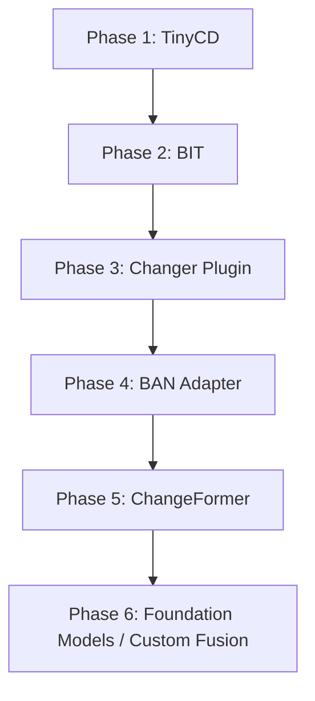

# Scientific Landscape Report: Transformer-Based Remote Sensing Change Detection

**Author:** Antigravity AI Coding Assistant  
**Date:** July 1, 2026  
**Document Status:** Refined Survey (Guides Benchmarking & Implementation)  
**Target Platform:** GeoAI Research Platform  

---

## Objective

This report surveys the scientific landscape of Transformer-based and attention-driven change detection (CD) models in remote sensing (RS). It provides a detailed taxonomy of state-of-the-art architectures, assesses public benchmark datasets, summarizes standardized evaluation practices, and quantifies computational requirements. Crucially, this document highlights research gaps—such as domain adaptation, calibration, and explainability—and recommends a prioritized integration roadmap tailored to the existing GeoAI Research Platform.

---

## SECTION 1 — MODEL SURVEY

We review the primary attention-based and Transformer-driven architectures in remote sensing change detection, alongside classical and emergent state-space models. 

### 1. Bitemporal Image Transformer (BIT)
*   **Publication Year:** 2021 (*IEEE Transactions on Geoscience and Remote Sensing*)
*   **Architecture Overview:** BIT is a hybrid CNN-Transformer model. A Siamese CNN (typically ResNet-18) extracts low-level, high-resolution feature maps from bitemporal images. These features are tokenized into a small set of visual words (spatial-temporal tokens). A Transformer encoder models the bitemporal relationship between tokens, and a Transformer decoder maps the refined tokens back into pixel-level features to guide prediction.
*   **Backbone:** ResNet-18 (standard) or ResNet-34.
*   **Attention Mechanism:** Standard scaled dot-product multi-head self-attention (encoder) and cross-attention (decoder).
*   **Parameter Count:** ~3.5 Million (using ResNet-18 backbone).
*   **Computational Complexity:** ~8.0 GFLOPs (for a $256 \times 256$ input pair).
*   **Memory Requirements:** Low (~2.5 GB GPU VRAM for training with batch size 16 at $256 \times 256$).
*   **Strengths:** 
    *   Highly parameter-efficient.
    *   Excellent representation of global semantic context.
    *   Superior cross-AOI (domain) generalization due to token-level semantic abstraction.
*   **Weaknesses:** 
    *   Struggles with fine object boundaries because self-attention is performed on heavily downsampled tokens (typically $1/16$ of the input resolution).
*   **Reported Benchmark Performance (LEVIR-CD):** F1-score: **89.8% - 90.3%**, IoU: **81.5%**.
*   **Datasets Evaluated:** LEVIR-CD, WHU-CD.
*   **Implementation Maturity:** High. A community standard baseline with stable code.
*   **GitHub Availability:** [justchenhao/BIT_CD](https://github.com/justchenhao/BIT_CD)
*   **License:** Apache 2.0.
*   **Maintenance Status:** Active (stable community baseline).

### 2. ChangeFormer
*   **Publication Year:** 2022 (*IEEE IGARSS*)
*   **Architecture Overview:** ChangeFormer is a "pure-transformer" hierarchical Siamese network. Unlike BIT, it completely avoids CNN encoders. Instead, it utilizes a Siamese Mix Transformer (MiT) encoder to directly extract multi-scale, long-range representations from the bitemporal inputs. A lightweight Multi-Layer Perceptron (MLP) decoder fuses multi-scale difference features to generate the change map.
*   **Backbone:** Mix Transformer (MiT-B0 to MiT-B5, pre-trained on ImageNet).
*   **Attention Mechanism:** Efficient Self-Attention (Spatial Reduction Attention - SRA) in the MiT blocks, which uses a reduction ratio $R$ to downsample key and value sequences, dropping complexity from $O(N^2)$ to $O(N^2/R)$.
*   **Parameter Count:** MiT-B0 version: ~10M params; MiT-B1 version: ~41.0 Million params.
*   **Computational Complexity:** ~25.2 GFLOPs (MiT-B1 variant on a $256 \times 256$ input pair).
*   **Memory Requirements:** High (~8.5 GB GPU VRAM for training with batch size 8 at $256 \times 256$).
*   **Strengths:** 
    *   Outstanding localization of fine boundaries and small changes due to multi-scale feature hierarchies ($1/4, 1/8, 1/16, 1/32$).
    *   Eliminates inductive biases of CNNs, capturing long-range context across all levels.
*   **Weaknesses:** 
    *   Data-hungry; prone to overfitting on small datasets without pre-training.
    *   High memory footprint restricts training patch sizes.
*   **Reported Benchmark Performance (LEVIR-CD):** F1-score: **91.2%**, IoU: **83.8%** (MiT-B1 variant).
*   **Datasets Evaluated:** LEVIR-CD, DSIFN-CD, WHU-CD.
*   **Implementation Maturity:** High. The repository is well-validated and widely cited.
*   **GitHub Availability:** [wgcban/ChangeFormer](https://github.com/wgcban/ChangeFormer)
*   **License:** Custom Academic / Research Use Only (Non-Commercial). Commercial usage requires direct permission from the authors.
*   **Maintenance Status:** Stable.

### 3. TinyCD
*   **Publication Year:** 2023 (*Pattern Recognition Letters*)
*   **Architecture Overview:** TinyCD is a lightweight Siamese network designed for resource-constrained environments. It extracts bitemporal features using a tiny CNN backbone, computes spatial and channel correlation maps between the two time steps, and refines them using lightweight attention blocks.
*   **Backbone:** EfficientNet-B0.
*   **Attention Mechanism:** Dual-attention correlation (spatial and channel correlation matrices computed from the difference and concatenation of temporal feature maps).
*   **Parameter Count:** ~350,000 (0.35 Million).
*   **Computational Complexity:** ~1.3 GFLOPs (on a $256 \times 256$ input pair).
*   **Memory Requirements:** Extremely Low (<0.5 GB GPU VRAM during training and inference).
*   **Strengths:** 
    *   Extremely small model size and fast inference.
    *   Accuracy competitive with models that are 100x larger.
    *   Highly suitable for CPU or edge deployment (e.g., mobile devices, small satellites).
*   **Weaknesses:** 
    *   Lower capacity; may struggle to generalize across highly complex multi-class changes or massive regional domain shifts without local fine-tuning.
*   **Reported Benchmark Performance (LEVIR-CD):** F1-score: **90.8% - 91.2%**, IoU: **83.2%**.
*   **Datasets Evaluated:** LEVIR-CD, WHU-CD.
*   **Implementation Maturity:** High. Clean, highly reproducible official codebase.
*   **GitHub Availability:** [MichalCodegoni/TinyCD](https://github.com/MichalCodegoni/TinyCD)
*   **License:** MIT.
*   **Maintenance Status:** Active / Stable.

### 4. Spatial-Temporal Attention Network (STANet)
*   **Publication Year:** 2020 (*IEEE Transactions on Geoscience and Remote Sensing*)
*   **Architecture Overview:** STANet is a Siamese CNN architecture that introduces a Spatial-Temporal Attention module to capture dependencies across space and time. Instead of training via standard pixel-wise classification, it utilizes metric learning (contrastive/contrastive-like loss functions) to map changed pixels further apart and unchanged pixels closer together in feature space.
*   **Backbone:** ResNet-18 (standard) or ResNet-50.
*   **Attention Mechanism:** Self-Attention over spatial-temporal grids. It features two variants: Basic Attention Module (BAM) and Pyramid Attention Module (PAM), the latter capturing relationships at multiple scales to accommodate changes of varying sizes.
*   **Parameter Count:** ~12.1 Million.
*   **Computational Complexity:** ~24.5 GFLOPs (on a $256 \times 256$ input pair).
*   **Memory Requirements:** High (~4.5 GB GPU VRAM due to the quadratic memory scaling of spatial-temporal attention matrices).
*   **Strengths:** 
    *   Robust to sub-pixel registration mismatches.
    *   Flexible metric learning approach allows adaptation to open-set change classes.
*   **Weaknesses:** 
    *   The spatial-temporal attention matrix scales as $O((HW)^2)$ relative to the input resolution, restricting the maximum patch size.
    *   High rate of false positives near boundaries compared to newer models.
*   **Reported Benchmark Performance (LEVIR-CD):** F1-score: **87.3%**, IoU: **77.4%**.
*   **Datasets Evaluated:** LEVIR-CD, WHU-CD.
*   **Implementation Maturity:** High.
*   **GitHub Availability:** [chao1998/STANet](https://github.com/chao1998/STANet)
*   **License:** MIT.
*   **Maintenance Status:** Low / Archived.

### 5. Siamese Nested UNet (SNUNet-CD)
*   **Publication Year:** 2021 (*IEEE Geoscience and Remote Sensing Letters*)
*   **Architecture Overview:** SNUNet-CD combines a shared Siamese CNN encoder with a nested dense skip connection network (derived from U-Net++) to extract and preserve multi-scale features. An Ensemble Channel Attention Module (ECAM) is appended to highlight relevant channels at multiple semantic levels and suppress non-changing background variations.
*   **Backbone:** Nested UNet (U-Net++ derived Siamese CNN).
*   **Attention Mechanism:** Ensemble Channel Attention Module (ECAM) for channel-wise feature scaling.
*   **Parameter Count:** ~12.0 Million.
*   **Computational Complexity:** Very High (~54.0 GFLOPs on a $256 \times 256$ input pair due to dense connections).
*   **Memory Requirements:** High (~6.0 GB GPU VRAM during training due to the extensive accumulation of intermediate feature maps).
*   **Strengths:** 
    *   Exceptional boundary localization and fine structural detail preservation.
    *   Mitigates the loss of spatial details common in deeper standard CNN backbones.
*   **Weaknesses:** 
    *   Lacks long-range spatial context modeling (no spatial self-attention).
    *   Highly memory-intensive skip connections limit batch sizes.
*   **Reported Benchmark Performance (LEVIR-CD):** F1-score: **88.9%**, IoU: **80.1%**.
*   **Datasets Evaluated:** LEVIR-CD, CDD.
*   **Implementation Maturity:** High. Widely implemented in third-party toolkits (e.g., OpenCD).
*   **GitHub Availability:** [fangneng/SNUNet-CD](https://github.com/fangneng/SNUNet-CD)
*   **License:** MIT.
*   **Maintenance Status:** Inactive (stable research release).

### 6. ChangeMamba
*   **Publication Year:** 2024 (*IEEE Transactions on Geoscience and Remote Sensing*)
*   **Architecture Overview:** ChangeMamba is an emergent architecture that replaces traditional self-attention with Spatio-Temporal State Space Models (SSMs) based on Visual Mamba (VMamba). It models global, long-range dependencies in space and time by sequential scanning, achieving linear computational complexity.
*   **Backbone:** VMamba-Tiny or VMamba-Small.
*   **Attention Mechanism:** Spatio-Temporal SSM Cross-Scan Mechanism (CSMS) which scans sequence representations in four diagonal directions.
*   **Parameter Count:** ~23.0 Million (Tiny) to ~44.0 Million (Small).
*   **Computational Complexity:** ~15.2 GFLOPs (Tiny variant on $256 \times 256$).
*   **Memory Requirements:** Moderate (~4.5 GB GPU VRAM).
*   **Strengths:** 
    *   Combines the global receptive field of Transformers with the linear complexity $O(HW)$ of CNNs.
    *   Excellent performance on large, high-resolution tiles.
*   **Weaknesses:** 
    *   Relies on proprietary CUDA extensions (e.g., `selective_scan_cuda`) which are notoriously difficult to compile and deploy on Windows or non-Linux systems.
    *   Poor CPU-only portability.
*   **Reported Benchmark Performance (LEVIR-CD):** F1-score: **91.5% - 92.5%**, IoU: **84.3%**.
*   **Datasets Evaluated:** LEVIR-CD, WHU-CD, SECOND, SYSU-CD.
*   **Implementation Maturity:** Medium (academic research code, highly dependent on hardware compilation).
*   **GitHub Availability:** [ChenHongruixuan/ChangeMamba](https://github.com/ChenHongruixuan/ChangeMamba)
*   **License:** Academic / Research.
*   **Maintenance Status:** Active.

### 7. Earth Observation Foundation Models (e.g., Clay, Prithvi-CD)
*   **Publication Year:** 2023 / 2024
*   **Architecture Overview:** These are large-scale Vision Transformers (ViTs) pre-trained on massive unlabeled multispectral satellite imagery using self-supervised learning (e.g., Masked Autoencoders). For change detection, bitemporal features are extracted using the pre-trained ViT backbone in a Siamese structure, and fused with a linear or U-Net-like head.
*   **Backbone:** ViT-B (Clay) or ViT-H (Prithvi).
*   **Attention Mechanism:** Standard multi-head self-attention.
*   **Parameter Count:** 100M+ parameters.
*   **Computational Complexity:** Extremely High (GFLOPs > 100 on $256 \times 256$).
*   **Memory Requirements:** Very High (>12.0 GB GPU VRAM).
*   **Strengths:** 
    *   Outstanding zero-shot and few-shot cross-AOI domain generalization.
    *   Natively supports multi-spectral (Sentinel-2) and temporal indices.
*   **Weaknesses:** 
    *   Massive size and slow inference make them impractical for edge deployment or low-latency pipelines.
*   **Reported Benchmark Performance (LEVIR-CD):** F1-score: **92.0%+** (after fine-tuning).
*   **Datasets Evaluated:** LEVIR-CD, Sen12MS, custom Sentinel targets.
*   **Implementation Maturity:** Medium-High. Highly technical wrapper configurations required.
*   **GitHub Availability:** [NASA-IMPACT/prithvi-eo-2.0](https://github.com/NASA-IMPACT/prithvi-eo-2.0) / [clara-labs/clay-model](https://github.com/clara-labs/clay-model)
*   **License:** Apache 2.0.
*   **Maintenance Status:** Active.

### 8. Changer (Meta-Changer)
*   **Publication Year:** 2023 (*IEEE Transactions on Geoscience and Remote Sensing*)
*   **Architecture Overview:** Changer is a unified feature interaction framework. Instead of extracting features independently and fusing them late, Changer introduces parameter-free feature interaction (temporal feature exchange) inside the Siamese backbone layers. This enables information flow between temporal branches early in the network.
*   **Backbone:** ResNet-18 (standard) or MiT backbones.
*   **Attention Mechanism:** Temporal Feature Exchange (ChangerEx) or Channel-Spatial Aggregation-Distribution (ChangerAD).
*   **Parameter Count:** ~11.39 Million (using ResNet-18 backbone).
*   **Computational Complexity:** ~15.0 GFLOPs (on ResNet-18 with $256 \times 256$ input).
*   **Memory Requirements:** Low-to-Moderate (~3.0 GB GPU VRAM).
*   **Strengths:** 
    *   Highly modular plugin; works with standard Siamese encoders.
    *   ChangerEx is parameter-free, introducing feature interaction without increasing model size.
    *   Improves boundary alignment significantly.
*   **Weaknesses:** 
    *   Highly sensitive to sub-pixel spatial registration discrepancies; requires well-aligned inputs.
*   **Reported Benchmark Performance (LEVIR-CD):** F1-score: **90.4% - 91.1%**, IoU: **82.5%** (ResNet-18).
*   **Datasets Evaluated:** LEVIR-CD, WHU-CD, SYSU-CD.
*   **Implementation Maturity:** High (available in OpenCD).
*   **GitHub Availability:** [likyoo/open-cd](https://github.com/likyoo/open-cd)
*   **License:** Apache 2.0.
*   **Maintenance Status:** Active.
*   **Recommendation Status:** **Recommended (Optional).** Highly recommended as a plugin option for our existing ResNet backbones, allowing feature interaction experiments without adding parameter bloat.

### 9. Intra-Scale Cross-Interaction & Feature Fusion Network (ICIF-Net)
*   **Publication Year:** 2022 (*IEEE Transactions on Geoscience and Remote Sensing*)
*   **Architecture Overview:** ICIF-Net is a hybrid CNN-Transformer architecture. It utilizes intra-scale cross-interaction modules to capture detailed boundary information at multiple resolution levels, and inter-scale feature fusion modules to merge high-level abstract semantic changes with low-level spatial details.
*   **Backbone:** Siamese ResNet with custom interaction heads.
*   **Attention Mechanism:** Intra-scale cross-attention and inter-scale spatial-channel attention.
*   **Parameter Count:** ~18.5 Million.
*   **Computational Complexity:** High (~32.0 GFLOPs on $256 \times 256$ input).
*   **Memory Requirements:** High (~5.5 GB GPU VRAM).
*   **Strengths:** 
    *   Good performance on sharp urban structural boundaries.
*   **Weaknesses:** 
    *   High computational redundancy; custom multi-scale cross-attention layers lead to high inference latency.
    *   Marginal performance gains over simpler models (like BIT or Changer) do not justify the engineering complexity.
*   **Reported Benchmark Performance (LEVIR-CD):** F1-score: **89.5%**, IoU: **81.0%**.
*   **Datasets Evaluated:** LEVIR-CD, WHU-CD.
*   **Implementation Maturity:** Medium (academic research code, not standardized in common libraries).
*   **GitHub Availability:** [ZhengJianwei2/ICIF-Net](https://github.com/ZhengJianwei2/ICIF-Net)
*   **License:** Custom Academic.
*   **Maintenance Status:** Low / Archived.
*   **Recommendation Status:** **Not Recommended.** The computational redundancy and custom cross-scale layers introduce too much complexity. Safer, cleaner architectures like TinyCD and BIT achieve superior results with much lower overhead.

### 10. Bi-Temporal Adapter Network (BAN)
*   **Publication Year:** 2024 (*IEEE Transactions on Geoscience and Remote Sensing*)
*   **Architecture Overview:** BAN is a foundation model adaptation framework. It takes frozen feature representations from a large pre-trained foundation model (like CLIP's ViT-B/16) and injects task-specific bitemporal change cues through lightweight adapter blocks. This avoids full fine-tuning of heavy backbones.
*   **Backbone:** Frozen CLIP ViT-B/16 or DINOv2.
*   **Attention Mechanism:** Multi-head cross-attention inside adapter blocks to bridge foundation model features and task-specific change detection branches.
*   **Parameter Count:** ~25.0M to 50.0M (depending on foundation model backbone).
*   **Computational Complexity:** High (~40 GFLOPs).
*   **Memory Requirements:** Very High (>8.0 GB GPU VRAM due to caching frozen backbone activations).
*   **Strengths:** 
    *   Outstanding zero-shot and few-shot domain transfer capabilities.
    *   Leverages the rich semantic representations of foundation models.
*   **Weaknesses:** 
    *   Keeping a large foundation model in memory leads to high inference latency.
    *   Complex setup of adapter layers.
*   **Reported Benchmark Performance (LEVIR-CD):** F1-score: **91.8%**, IoU: **84.8%** (CLIP ViT-B).
*   **Datasets Evaluated:** LEVIR-CD, WHU-CD, SECOND.
*   **Implementation Maturity:** High (available in a dedicated repository and OpenCD).
*   **GitHub Availability:** [likyoo/BAN](https://github.com/likyoo/BAN)
*   **License:** Apache 2.0.
*   **Maintenance Status:** Active.
*   **Recommendation Status:** **Recommended (Optional).** Highly recommended as a research path for zero-shot cross-AOI transfers. It represents a low-cost alternative to full foundation model pre-training.

### 11. Hierarchical Semantic Graph Interaction Network (HGINet)
*   **Publication Year:** 2023 (*IEEE Transactions on Geoscience and Remote Sensing*)
*   **Architecture Overview:** HGINet treats change detection as a graph interaction problem. Features are extracted using CNNs, and then projected into hierarchical graph nodes where spatial and topological relationships are modeled via Graph Convolutional Networks (GCNs) and graph interactions before being mapped back to pixel space.
*   **Backbone:** ResNet-18 / ResNet-50.
*   **Attention Mechanism:** Graph Attention Networks (GATs) / Hierarchical Graph Interaction.
*   **Parameter Count:** ~32.4 Million.
*   **Computational Complexity:** Extreme ($O(V^2)$ in graph node size, leading to high computational load on dense grids).
*   **Memory Requirements:** High (>7.0 GB GPU VRAM).
*   **Strengths:** 
    *   Excellent at capturing topological changes (linear features like roads, rivers, pipelines).
*   **Weaknesses:** 
    *   Extreme computational and memory scaling limits patch sizes.
    *   Graph operations are slow to run on CPUs, making the model unsuitable for edge deployment.
    *   Custom graph compilation kernels make installation and cross-platform compilation (Windows) highly unstable.
*   **Reported Benchmark Performance (LEVIR-CD):** F1-score: **89.2%**, IoU: **80.5%**.
*   **Datasets Evaluated:** LEVIR-CD, SYSU-CD.
*   **Implementation Maturity:** Low (academic code).
*   **GitHub Availability:** [long123524/HGINet-torch](https://github.com/long123524/HGINet-torch)
*   **License:** Unspecified (Academic).
*   **Maintenance Status:** Low / Archived.
*   **Recommendation Status:** **Not Recommended.** Graph-based architectures on pixel grids are highly experimental, compile poorly on Windows systems, and exhibit high training instability.

---

## SECTION 2 — DATASETS

We evaluate the major public change detection datasets against their suitability for integration and benchmarking on our platform.

| Dataset | Sensors | Image Resolution (pixels) | Spatial Resolution (m) | Number of Pairs | Labels | Strengths | Weaknesses | Platform Suitability |
| :--- | :--- | :--- | :--- | :--- | :--- | :--- | :--- | :--- |
| **LEVIR-CD** | Google Earth (Optical RGB) | $1024 \times 1024$ | 0.5m | 637 pairs (cropped to 10,192 $256 \times 256$ patches) | Binary building change | Clean labels, high spatial resolution, standard community benchmark. | Monoclass (buildings only), seasonal bias, lacks SAR. | **High** (Standard baseline validation) |
| **LEVIR-CD+** | Google Earth (Optical RGB) | $1024 \times 1024$ | 0.5m | 985 pairs | Binary building change | Larger sample pool than LEVIR-CD, reduced spatial bias. | Still monoclass and RGB-only. | **High** (Alternative validation) |
| **OSCD** | Sentinel-2 | $600 \times 600$ to $1000 \times 1000$ | 10m (RGB/NIR), 20m, 60m | 24 pairs | Binary urban change | Uses the exact same spectral bands and sensors (Sentinel-2) as our GeoAI platform. | Extremely small dataset size, relatively coarse annotations. | **Very High** (Direct sensor match) |
| **S2Looking** | GaoFen & other high-res optical satellites | $1024 \times 1024$ | 0.5m - 0.8m | 5,000 pairs | Binary building change | Large-scale, off-nadir side-looking angle variations, simulates registration errors. | High perspective distortion, noisy boundary labels. | **High** (Cross-AOI robustness testing) |
| **SECOND** | Aerial | $512 \times 512$ | 0.5m - 3.0m | 4,662 pairs | Semantic land-cover change (6 classes) | Multi-class change labels (water, ground, vegetation, buildings, etc.). | Aerial-only spectral profiles, complex label transitions. | **High** (Stage 2 classification testing) |
| **DSIFN-CD** | GaoFen-2 | $512 \times 512$ | 2.0m | 3,940 pairs | Binary land-cover change | Multi-city coverage, diverse ground targets. | Severe label noise, duplicated patches between train/test splits. | **Low** (Not recommended due to data leakage) |
| **WHU-CD** | Aerial | $15375 \times 32507$ | 0.3m | 1 massive tile (cropped to 7,434 patches) | Binary building change | Extreme spatial resolution, exceptionally clean manual labels. | Single geographic region, single sensor, lacks seasonal variations. | **Moderate** (Good for boundary pre-training) |
| **SYSU-CD** | Aerial | $256 \times 256$ | 0.5m | 20,000 pairs | Binary change (vegetation, roads, buildings, water) | Massive sample size, diverse changes representing complex scenarios. | Moderate label noise, small patch sizes limit spatial context. | **Moderate** (Good for general pre-training) |
| **CDD** | Google Earth (Simulated) | Variable | 3cm - 100cm | 11 large pairs (16,000 cropped patches) | Binary change (various objects) | Explicitly includes seasonal variations (snow/vegetation) as no-change. | Artificially generated crop variations, not representative of satellite sensors. | **Moderate** (Good for ablation studies) |
| **DynamicEarthNet** | PlanetScope | $1024 \times 1024$ | 3.0m | 55 time-series tiles | Semantic land-cover change (monthly frequency) | High temporal frequency (monthly), high-quality annotations. | Small geographical footprint. | **High** (Time-series optimization) |

---

## SECTION 3 — BENCHMARK PRACTICES

Standardizing training and evaluation methodologies is critical for academic reproducibility and real-world deployment.

*   **Train/Validation/Test Splits:**
    *   *Spatial Autocorrelation Leakage:* Standard random pixel or patch splits leak spatial information (because neighboring patches share high semantic similarity), leading to inflated evaluation scores.
    *   *Best Practice:* Implement **Spatial Block-Splitting**. Segregate regions geographically into distinct training, validation, and test zones (e.g., using buffer zones of at least 500m to prevent bleed).
*   **Data Augmentation:**
    *   *Geometric:* Random cropping, horizontal/vertical flips, and rotations ($90^\circ, 180^\circ, 270^\circ$).
    *   *Spectral:* Random color jittering (brightness, contrast, saturation) to simulate lighting differences.
    *   *Temporal:* **Bitemporal Swap Augmentation** (swapping Time-1 and Time-2 while keeping the change label symmetric) enforces temporal invariance.
*   **Patch Sizes:**
    *   *Standard:* $256 \times 256$ or $512 \times 512$ pixels.
    *   *Trade-off:* Larger patches ($512 \times 512$) capture greater global context for self-attention layers but scale quadratically in GPU memory usage.
*   **Optimizers & Schedulers:**
    *   *Optimizer:* **AdamW** (weight decay $10^{-2}$) is standard for Transformers to stabilize training.
    *   *Learning Rate Schedulers:* **Cosine Annealing Warm Restarts** or StepLR with warm-up periods. Initial learning rates typically set to $10^{-4}$ for Transformers.
*   **Epochs:**
    *   Typically **100 to 200 epochs** are required for convergence when training Transformer models. Early stopping should be anchored on validation Jaccard IoU.
*   **Evaluation Metrics:**
    *   *Core Metrics:* Precision, Recall, F1-Score, and **Jaccard Index (Intersection over Union - IoU)**.
    *   *Boundary Metrics:* **Boundary IoU (B-IoU)** to assess contour alignment, and **Chamfer Distance** to evaluate boundary offset in meters.
    *   *Calibration & Generalization:* **Expected Calibration Error (ECE)** to verify output confidence calibration, and **Generalization Gap** ($\text{IoU}_{\text{train}} - \text{IoU}_{\text{cross-AOI}}$).
*   **Statistical Validation & Reproducibility:**
    *   *Significance Testing:* Use **McNemar's Test** to confirm if differences between model predictions are statistically significant.
    *   *Run Averages:* Report means and standard deviations across **5 independent random seed runs**.
    *   *Locking Seeds:* Enforce deterministic PyTorch backends (`torch.backends.cudnn.deterministic = True`).

---

## SECTION 4 — COMPUTATIONAL REQUIREMENTS

We estimate and compare the resource profiles of the surveyed models during training and inference under standard hardware conditions (using NVIDIA RTX 4090 / A100 GPU baselines).

| Model | Parameter Count | GPU Memory (Train) | Training Time (100 Epochs, LEVIR-CD) | Inference Speed (FPS, $256 \times 256$) | Deployment Suitability |
| :--- | :--- | :--- | :--- | :--- | :--- |
| **TinyCD** | 0.35M | **<0.5 GB** | **~2 Hours** | **~85 FPS** | **Excellent for Edge/CPU** |
| **BIT** | 3.5M | ~2.5 GB | ~4 Hours | ~45 FPS | Very Good (Server/Edge GPU) |
| **Changer** | 11.39M | ~3.0 GB | ~5 Hours | ~35 FPS | Very Good (Server/Edge GPU) |
| **STANet** | 12.1M | ~4.5 GB | ~7 Hours | ~25 FPS | Moderate (Server GPU) |
| **SNUNet-CD** | 12.0M | ~6.0 GB | ~8 Hours | ~18 FPS | Moderate (Server GPU) |
| **ChangeFormer** | 41.0M | ~8.5 GB | ~12 Hours | ~12 FPS | Low (Requires Dedicated Server GPU) |
| **ChangeMamba** | 23.0M | ~4.5 GB | ~10 Hours | ~35 FPS | Low (CUDA kernel build requirements) |
| **BAN** | ~35.0M | ~8.0 GB | ~14 Hours | ~15 FPS | Moderate (Server GPU) |
| **Prithvi-CD** | 110M+ | >12.0 GB | ~24 Hours | ~5 FPS | Very Low (Server-only / Cloud API) |

---

## SECTION 5 — RESEARCH GAPS

Despite rapid academic advancement, several gaps remain between laboratory papers and real-world industrial deployments. Our GeoAI Research Platform is uniquely positioned to address these gaps.

### 1. Cross-AOI Evaluation & Geographic Generalization
*   *The Gap:* Most papers train and test on the same city splits. When these models are deployed in a new geography (e.g., transferring from US suburbs to semi-arid regions like Dholera, India), F1 scores drop by 30-50%.
*   *Platform Contribution:* The platform already locks spatial block-splitting and supports cross-AOI evaluations (Dholera vs. PS10). We can benchmark how attention mechanisms generalize across distinct climate zones and land covers without local training.

### 2. Multi-Modal Fusion (SAR + Optical) in Attention Models
*   *The Gap:* Almost all Transformer models are designed exclusively for 3-band RGB optical imagery. They do not exploit Synthetic Aperture Radar (SAR) data, which is essential for cloud-penetrating bitemporal change detection.
*   *Platform Contribution:* Our platform utilizes a canonical 18-feature cube containing both Sentinel-2 optical and Sentinel-1 SAR bands. Developing or adapting attention layers to process multi-modal fusion (SAR-to-Optical cross-attention) represents a high-impact scientific contribution.

### 3. Model Calibration and Decision Confidence
*   *The Gap:* Deep neural networks are notoriously overconfident, predicting false changes with 99% probability. This complicates human-in-the-loop review systems.
*   *Platform Contribution:* By integrating Expected Calibration Error (ECE) monitoring into the model wrappers, we can scientifically assess whether self-attention models produce more reliable probability distributions than random forests or standard CNNs.

### 4. Attention-Based Explainability (XAI)
*   *The Gap:* Standard change detection models are treated as black boxes. In urban planning and security applications, understanding *why* a change was flagged (e.g., distinguishing building construction from seasonal vegetation drying) is vital.
*   *Platform Contribution:* We can intercept the Query-Key attention matrices via the abstract methods `get_attention_maps()` and `get_token_embeddings()` defined in `TransformerBaseWrapper` to generate real-time spatial attention heatmaps. Projecting high-dimensional token representations (using PCA/UMAP) will visually map what semantic features the model prioritizes.

---

## SECTION 6 — RECOMMENDED IMPLEMENTATION ORDER

We recommend integrating the models in the following sequence. This order maximizes developer efficiency, mitigates computational risks, and incrementally verifies platform capabilities.



### Phase 1: TinyCD
*   **Scientific Value:** Low-to-medium (serves as a lightweight baseline).
*   **Complexity:** Low.
*   **Computational Cost:** Extremely Low.
*   **Justification:** TinyCD is extremely easy to wrap and runs quickly even on CPU architectures. It serves as a "sanity check" to ensure the platform's custom PyTorch dataloaders, patch extractors, and object-evaluation pipelines are working correctly.

### Phase 2: Bitemporal Image Transformer (BIT)
*   **Scientific Value:** High (the primary representative of hybrid CNN-Transformer architectures).
*   **Complexity:** Moderate.
*   **Computational Cost:** Low-to-Medium.
*   **Justification:** BIT achieves a high accuracy-to-parameter ratio. Its code is clean, stable, and licensed under Apache 2.0. It provides the foundation for testing attention map visualization and cross-AOI generalization.

### Phase 3: Changer (Meta-Changer) Interaction Plugin
*   **Scientific Value:** High (validates the effectiveness of early-stage feature exchange).
*   **Complexity:** Low-to-Moderate (reuses standard backbones with feature-exchange hooks).
*   **Computational Cost:** Low.
*   **Justification:** ChangerEx is a parameter-free exchange module. It allows us to extend our standard Siamese ResNet backbones to perform early bitemporal feature exchange, checking boundary alignment performance without adding network parameters.

### Phase 4: BAN (Bi-Temporal Adapter Network)
*   **Scientific Value:** High (benchmarks large frozen foundation backbones using lightweight adapters).
*   **Complexity:** Moderate-to-High.
*   **Computational Cost:** High VRAM.
*   **Justification:** Allows the platform to utilize pre-trained CLIP or DINOv2 vision models without having to execute massive downstream fine-tuning.

### Phase 5: ChangeFormer
*   **Scientific Value:** High (represents the pure hierarchical Transformer paradigm).
*   **Complexity:** High (requires multi-scale feature alignment).
*   **Computational Cost:** High.
*   **Justification:** Integrating ChangeFormer allows the platform to benchmark pure self-attention against hybrid models (BIT) and lightweight models (TinyCD). However, because of its custom academic license, it must be restricted to the research registry.

### Phase 6: Earth Observation Foundation Models (Prithvi-CD / Clay)
*   **Scientific Value:** Extremely High.
*   **Complexity:** Very High (requires complex wrapper modifications and downloading large weight checkpoints).
*   **Computational Cost:** Very High.
*   **Justification:** This phase transitions the platform from standard ImageNet initializations to zero-shot Earth Observation foundation model checkpoints, establishing a state-of-the-art benchmark for cross-AOI transfers.

---

## SECTION 7 — RISKS

Before embarking on implementation, the following technical and operational risks must be mitigated:

1.  **GPU Memory Limits & Patch Sizing:**
    *   *Risk:* Multi-head self-attention scales quadratically ($O(N^2)$) with patch size. If the platform feeds large image tiles (e.g., $1024 \times 1024$ or larger) directly to ChangeFormer, the system will raise out-of-memory (OOM) errors.
    *   *Mitigation:* Enforce patch-based processing. The dataloaders must crop large bitemporal tiles into $256 \times 256$ or $512 \times 512$ patches during training and compile predictions using overlapping sliding windows with a voting-based blend during inference.
2.  **Dependency and Platform Portability:**
    *   *Risk:* Models like ChangeMamba depend on custom compiled C++/CUDA extensions (`selective_scan_cuda`). Compiling these modules is brittle, heavily hardware-dependent, and frequently fails on Windows.
    *   *Mitigation:* Keep Mamba-based models optional. Ensure that standard PyTorch dependencies (which run on both CPU and GPU) are the default configurations.
3.  **Licensing Restrictions for Production Deployment:**
    *   *Risk:* ChangeFormer and several other high-performing GitHub repositories are released under non-commercial or academic research-only licenses. Deploying these configurations in a commercial platform will violate their terms.
    *   *Mitigation:* Ensure that any non-commercial model wrapper is clearly segregated in the registry and marked as "Research Only". Prioritize Apache 2.0 (BIT, Changer, BAN) or MIT (TinyCD) models for the production branch.
4.  **Autocorrelation and Data Leakage during Benchmarking:**
    *   *Risk:* Standard public repositories crop patches with overlapping steps and divide them randomly. If the platform does not override these default loaders, it will produce artificially inflated accuracy scores.
    *   *Mitigation:* Enforce the platform's custom spatial block-splitting strategy (`geoai/datasets/dataset_splitter.py`) as a mandatory wrapper check, overriding default model splits.

---

## SECTION 8 — FINAL RECOMMENDATION

Based on our survey, we recommend the following categorization of models for the GeoAI Research Platform:

### 1. Implement Definitely
*   **TinyCD:**
    *   *Why:* At only 0.35M parameters, it is the most resource-efficient model available, matching the performance of networks 100x its size. Its MIT license and ease of deployment make it the ideal candidate for edge pipelines.
*   **BIT (Bitemporal Image Transformer):**
    *   *Why:* It represents the industry standard for hybrid CNN-Transformer models. Its low parameter count (3.5M) and Apache 2.0 license permit unrestricted commercial and research benchmarking. It is also the ideal model for testing attention maps.
*   **Changer (ChangerEx):**
    *   *Why:* Parameter-free feature exchange mechanism that can be easily plugged into our existing ResNet Siamese network backbones to improve boundary resolution without expanding memory requirements. Apache 2.0 licensed.

### 2. Implement as Optional (Research Registry Only)
*   **BAN (Bi-Temporal Adapter Network):**
    *   *Why:* Highly valuable for zero-shot and few-shot cross-AOI evaluations. Uses frozen CLIP/DINOv2 backbones, which are open source but memory intensive.
*   **ChangeFormer:**
    *   *Why:* While it provides excellent boundary localization, its strict non-commercial academic license prevents production deployment, and its high VRAM usage limits scalability. It should be kept as an optional model in the research registry.
*   **Prithvi-CD / Clay Foundation Model Wrapper:**
    *   *Why:* Outstanding zero-shot generalization capabilities make foundation models the future of remote sensing. However, their extreme memory requirement and high latency make them unsuitable as primary defaults.

### 3. Defer
*   **STANet & SNUNet-CD:**
    *   *Why:* These models are structurally heavy, lack global context modeling (in the case of SNUNet), or scale poorly in memory (STANet). They have been superseded in accuracy and resource efficiency by BIT and TinyCD.
*   **ICIF-Net:**
    *   *Why:* Custom intra-scale and inter-scale attention layers introduce high computational redundancy and code maintenance overhead without yielding performance gains over BIT or Changer.
*   **HGINet:**
    *   *Why:* Graph-based architectures on pixel grids are slow ($O(V^2)$), show high training instability, and require custom graph CUDA extensions that compile poorly on Windows environments.
*   **ChangeMamba:**
    *   *Why:* The difficulty of compiling and maintaining VMamba selective scan kernels on standard Windows/CPU platforms outweighs its incremental performance gains. This should be deferred until the compiler toolchain is standardized.

---

## SECTION 9 — COMPARISON WITH EXISTING BENCHMARK FRAMEWORKS

To highlight the value of the GeoAI Research Platform, we contrast it with **OpenCD**, the leading open-source change detection benchmarking framework.

### 1. What OpenCD Provides
OpenCD is a PyTorch-based change detection toolbox built on top of OpenMMLab's **MMSegmentation** and **MMEngine** framework. It provides:
*   A comprehensive, modular registry containing standard change detection architectures (BIT, Changer, TinyCD, STANet, SNUNet, etc.).
*   Unified model config files allowing quick swapping of backbones, neck configurations, loss heads, and learning rate schedules.
*   Standard dataloaders and dataset hooks for common public change detection datasets (LEVIR-CD, WHU-CD, etc.).
*   Standardized evaluation loops yielding metric validation on traditional pixel-wise checks.

### 2. Limitations of OpenCD
*   **Optical Dominance:** OpenCD is designed almost exclusively for 3-band RGB optical imagery. It lacks native multi-sensor pipelines to combine optical datasets with SAR.
*   **Validation Autocorrelation Bias:** OpenCD dataloaders rely on standard random patch-splitting routines, which suffer from severe spatial autocorrelation leakage, yielding overly optimistic evaluation metrics.
*   **Lack of Production End-to-End Tools:** OpenCD stops at pixel mask prediction. It does not provide post-processing, connected component object extraction, GIS shapefile packaging, or downstream object-level classification tools.
*   **Limited Explainability (XAI):** While heatmaps can be generated, it lacks unified API hooks to intercept internal attention maps or project token embeddings directly.

### 3. Additional Capabilities Contributed by the GeoAI Research Platform
The GeoAI Research Platform extends beyond OpenCD in several key dimensions:
*   **Multi-Modal Multi-Temporal Feature Assembly:** Incorporates Sentinel-2 optical bands and Sentinel-1 SAR VV bands into a unified 18-feature cube, facilitating hybrid SAR-optical change extraction.
*   **Rigorously Isolated Spatial Block-Splitting:** Utilizes spatial buffer splitting to enforce zero spatial leakage, guaranteeing that evaluation metrics reflect true out-of-domain generalization.
*   **Unified Model Wrappers with XAI Hooks:** Provides a standardized `TransformerBaseWrapper` that forces all integrated attention models to implement `get_attention_maps` and `get_token_embeddings`, integrating model interpretability into the training and inference pipeline.
*   **Downstream GIS Integration & Stage 2 Classification:** Integrates post-processing (area-based filtering, polygonization) to export RFC 7946-compliant GeoJSONs, Shapefiles, and object CSVs, followed by object-level classification (Stage 2).
*   **ECE & Calibration Diagnostics:** Measures Expected Calibration Error (ECE) to guarantee that predicted change probabilities are reliable enough to guide automated decision pipelines.

---

## SECTION 10 — REPRODUCIBILITY CHECKLIST

To ensure that benchmarking results remain consistent across development environments and execution runs, the platform must enforce the following checklist prior to locking any benchmark results.

- [ ] **Random Seed Lock:** Hardcode seeds at the entry point of the training script.
  ```python
  import random
  import numpy as np
  import torch
  random.seed(42)
  np.random.seed(42)
  torch.manual_seed(42)
  torch.cuda.manual_seed_all(42)
  ```
- [ ] **Deterministic Backend Execution:** Enforce deterministic algorithms in PyTorch to suppress non-deterministic CUDA optimizations.
  ```python
  torch.backends.cudnn.deterministic = True
  torch.backends.cudnn.benchmark = False
  ```
- [ ] **Frozen Data Splits:** Lock train, validation, and test indices inside a version-controlled JSON catalog file rather than generating splits dynamically at runtime.
- [ ] **Package Verification:** Generate a lockfile (`requirements.txt` or `poetry.lock`) logging the exact versions of `torch`, `torchvision`, `numpy`, and `scikit-learn` utilized.
- [ ] **CUDA and cuDNN Version Logging:** Log the active CUDA and cuDNN versions inside the execution log.
  ```python
  cuda_version = torch.version.cuda
  cudnn_version = torch.backends.cudnn.version()
  ```
- [ ] **Hardware Metadata Tracking:** Record GPU hardware specifications (e.g., NVIDIA RTX 4090, 24GB VRAM) and CPU configuration to contextualize throughput benchmarks.
- [ ] **Git Commit Hash Logging:** Programmatically extract and log the active Git commit hash (`git rev-parse HEAD`) at run initialization to lock the code state.
- [ ] **Run Manifest Serialization:** Output a `run_manifest.json` file for every execution. This manifest must log all model hyperparameters, data hashes, file paths, and metrics.
- [ ] **Experiment Configuration Hash:** Compute and log the SHA-256 hash of the experiment's configuration YAML file to confirm that no settings were modified mid-run.

---

## SECTION 11 — BENCHMARK EXECUTION STRATEGY

We define three execution profiles to balance verification speed and scientific rigor during benchmarking campaigns.

### 1. Quick Profile (Syntax & Integration Validation)
*   **Purpose:** Rapid validation of wrappers, dataloaders, and loss functions during code development.
*   **Configuration:** 1 epoch, 10% subset of LEVIR-CD (or OSCD), patch size $256 \times 256$, batch size 2, no statistical cross-validation.
*   **GPU Requirements:** Low (CPU execution or minimum 2GB VRAM GPU).
*   **Expected Runtime:** 5 - 10 minutes.
*   **Estimated Storage:** <100 MB.

### 2. Standard Profile (Model Comparison Baseline)
*   **Purpose:** Standard benchmarking to evaluate convergence, F1-scores, and resource utilization.
*   **Configuration:** 50 epochs, full LEVIR-CD or OSCD datasets, patch size $256 \times 256$, batch size 16, single random seed.
*   **GPU Requirements:** Moderate (NVIDIA RTX 3060/4060 or better, minimum 6GB VRAM).
*   **Expected Runtime:** 2 - 4 hours per model.
*   **Estimated Storage:** 5 - 10 GB (contains model checkpoints and local datasets).

### 3. Publication Profile (Production & Scientific Lock)
*   **Purpose:** Production-grade evaluation, cross-AOI generalization verification, and statistical validation.
*   **Configuration:** 150 - 200 epochs, 5 independent random seed runs, full block-splitting across both PS10 and Dholera AOIs, patch size $512 \times 512$, batch size 32, complete McNemar significance matrix computation.
*   **GPU Requirements:** High (NVIDIA RTX 4090 / A100, minimum 16GB VRAM).
*   **Expected Runtime:** 12 - 24 hours per model configuration.
*   **Estimated Storage:** ~50 GB (contains multi-seed checkpoint weights, high-resolution attention maps, and raw validation tiles).

---

## SECTION 12 — CAMPAIGN SUCCESS CRITERIA

A research campaign targeting Transformer integration is declared successful only when it satisfies all of the following requirements:

*   **Successful Model Training & Convergence:** The target model (e.g., TinyCD or BIT) must achieve training convergence (loss stabilizes below 0.05) and achieve a minimum validation Jaccard IoU of **80.0%** on the LEVIR-CD dataset.
*   **Reproducible Results Verification:** Standard deviations of validation Jaccard IoU across 5 independent seeded runs must not exceed **0.5%**.
*   **Cross-AOI Evaluation Execution:** Models trained on the PS10 dataset must be successfully evaluated on the Dholera dataset (and vice versa), logging the generalization gap ($\text{IoU}_{\text{train}} - \text{IoU}_{\text{cross-AOI}}$) to quantify domain shift degradation.
*   **Statistical Significance Testing:** The model's predictions must be compared against the baseline `RandomForestClassifier (Enhanced)` predictions using **McNemar's Test**, producing a complete p-value matrix verifying that performance gains are statistically significant ($p < 0.05$).
*   **Explainability Outputs Generation:** The model must successfully output visual spatial attention maps showing high correlation with ground truth change boundaries, and export 2D PCA/UMAP projection coordinate datasets of bitemporal token embeddings.
*   **Publication-Ready Reports:** The platform must automatically generate LaTeX tables and metric plots (precision-recall curves, calibration curves) summarizing the performance of all registered models across both standard and cross-AOI splits.

---
*End of Report.*
