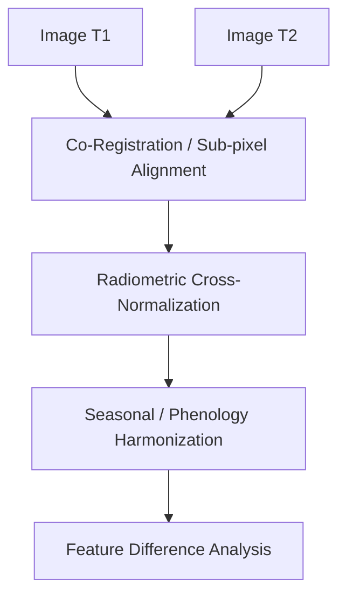

# Preprocessing & Feature Engineering Research Report

This report provides a comprehensive scientific analysis of preprocessing and feature engineering methodologies for multi-temporal **Sentinel-1 (SAR)** and **Sentinel-2 (EO)** change detection. It establishes the theoretical and empirical foundation for future implementation modules on the GeoAI Platform.

---

## 1. Sentinel-1 Preprocessing

Sentinel-1 Ground Range Detected (GRD) data requires a series of radiometric and geometric corrections to transform raw backscatter amplitude into stable, co-registered backscatter coefficients ($\sigma^0$ or $\gamma^0$) suitable for change analysis.

### 1.1 Orbit Correction
*   **Purpose**: Update metadata with precise satellite orbit state vectors. Standard orbit files (annotated during acquisition) have positional errors up to several meters.
*   **Mathematical Intuition**: Re-calculates satellite position and velocity at the time of each pulse using Earth gravity models and tracking network measurements. Utilizes ESA's **Precise Orbit Determination (POD)** Precise Orbits (available after 20 days, error < 5 cm) or Reconstructed Orbits (available in 3 hours, error < 10 cm).
*   **Computational Cost**: Low ($O(N)$ metadata update).
*   **Advantages**: Crucial for sub-pixel geometric co-registration between dates.
*   **Disadvantages**: Requires internet connection to fetch POD files from Copernicus servers.
*   **Adoption in Literature**: Universal. A mandatory first step in all SAR processing chains (e.g., ESA SNAP, GEE).

### 1.2 Thermal Noise Removal
*   **Purpose**: Remove background noise introduced by the instrument's internal temperature and electronics, particularly visible as high-frequency noise in low-backscatter regions (e.g., calm water, runway strips) and cross-polarization bands (VH).
*   **Mathematical Intuition**: Subtracts a sensor-derived noise lookup table (noise-equivalent sigma-zero, NESZ) from the intensity image:
    $$I_{\text{corrected}} = I_{\text{raw}} - \eta$$
    where $I$ is intensity and $\eta$ is NESZ. If the result is negative, it is clipped to a small positive epsilon.
*   **Computational Cost**: Low ($O(HW)$ pixel-wise subtraction).
*   **Advantages**: Restores physical meaning to low-return features; prevents false change detection over smooth surfaces.
*   **Disadvantages**: Noise vectors are interpolated, which can leave residual artifacts at swath boundaries.
*   **Adoption in Literature**: Standard for Sentinel-1. Documented extensively in ESA S1 technical guides.

### 1.3 Radiometric Calibration
*   **Purpose**: Convert raw digital numbers (DN) to physically calibrated backscatter coefficients ($\sigma^0$, $\beta^0$, or $\gamma^0$) representing target radar cross-section.
*   **Mathematical Intuition**: Maps DN to radar cross-section per unit area using scaling lookup tables ($A_{\sigma}$):
    $$\sigma^0 = \frac{DN^2}{A_{\sigma}^2}$$
*   **Computational Cost**: Low ($O(HW)$ division).
*   **Advantages**: Ensures backscatter values are comparable across different sensors, geometries, and dates.
*   **Disadvantages**: None.
*   **Adoption in Literature**: Mandatory. Typically calibrated to $\sigma^0$ (Sigma Nought, area projected on ground) or $\gamma^0$ (Gamma Nought, area projected perpendicular to line-of-sight).

### 1.4 Terrain Correction (Range-Doppler Terrain Correction)
*   **Purpose**: Geocodes the radar image from range-doppler coordinates to geographic coordinates, correcting geometric distortions like foreshortening, layover, and shadow caused by topographic variations.
*   **Mathematical Intuition**: Employs a Digital Elevation Model (DEM) (e.g., Copernicus DEM, SRTM) to project 3D terrain coordinates into the 2D radar slant range and doppler coordinate system:
    $$r = \sqrt{(X_{\text{sat}} - X_{\text{target}})^2}$$
*   **Computational Cost**: High ($O(HW \cdot \text{kernel})$ interpolation and coordinate transforms).
*   **Advantages**: Align SAR features geometrically with Sentinel-2 and vector map grids.
*   **Disadvantages**: Accuracy depends heavily on the DEM resolution and quality.
*   **Adoption in Literature**: Mandatory for any spatial mapping or fusion workflows.

### 1.5 Speckle Filtering
Speckle is multiplicative, granular noise ("salt-and-pepper") inherent in coherent imaging systems like SAR, caused by random constructive and destructive interference of the returning waves.

```
+------------------+----------------------------------+------------------------------+---------------------------+
| Filter Class     | Mathematical Concept             | Advantages                   | Disadvantages             |
+------------------+----------------------------------+------------------------------+---------------------------+
| Box / Mean       | Local uniform average            | Fast, simple                 | Blurs edges, degrades resolution|
+------------------+----------------------------------+------------------------------+---------------------------+
| Lee Filter       | Local variance-weighted adaptive | Preserves edges, reduces noise| Fails in highly textured areas |
+------------------+----------------------------------+------------------------------+---------------------------+
| Refined Lee      | Directional window selection     | Excellent edge/line retention | Moderate computational cost|
+------------------+----------------------------------+------------------------------+---------------------------+
| Gamma MAP        | Bayesian Maximum A Posteriori     | Excellent for land cover / ag | Assumes specific statistical model|
+------------------+----------------------------------+------------------------------+---------------------------+
| Multi-Temporal   | Coregistered cross-date filtering| Reduces noise without blurring| Requires multiple co-registered dates|
+------------------+----------------------------------+------------------------------+---------------------------+
```

#### Lee Filter
*   **Mathematical Intuition**: Linearizes the multiplicative noise model and computes a weighted average of the pixel value and local mean based on the local coefficient of variation ($C_v = \sigma / \mu$):
    $$\hat{I} = \mu + W(I - \mu)$$
    where $W = 1 - \frac{C_r^2}{C_v^2}$, and $C_r$ is the noise standard deviation.
*   **Computational Cost**: Medium ($O(HW \cdot K^2)$ local variance calculation).
*   **Advantages**: Adaptively smooths homogeneous regions while keeping edges sharp.
*   **Disadvantages**: Window size selection is a trade-off between smoothing power and detail loss.
*   **Adoption in Literature**: High baseline filter.

#### Refined Lee Filter
*   **Mathematical Intuition**: Determines the orientation of edges within a window using gradient operators and selects a non-symmetric sub-window to compute statistics, preventing filtering across boundaries.
*   **Computational Cost**: High ($O(HW \cdot \text{directions})$ directional search).
*   **Advantages**: Outstanding retention of linear features, roads, and buildings.
*   **Disadvantages**: Complex implementation.
*   **Adoption in Literature**: Extensively used in urban and feature-oriented SAR change detection.

#### Gamma MAP (Maximum A Posteriori)
*   **Mathematical Intuition**: Assumes a Gamma distribution for the radar backscatter and a K-distribution for the terrain texture. Estimates the true backscatter $\hat{R}$ that maximizes the posterior probability density:
    $$\hat{R} = \frac{B \cdot \mu + \sqrt{B^2 \cdot \mu^2 + 4 \cdot A \cdot \alpha \cdot I}}{2 \cdot A}$$
    where $A$, $B$, $\alpha$ are parameters derived from local statistics and equivalent number of looks (ENL).
*   **Computational Cost**: High (requires solving quadratic equations per pixel).
*   **Advantages**: Highly effective at modeling realistic natural radar scattering statistics.
*   **Disadvantages**: Over-smooths urban areas where distribution assumptions break down.
*   **Adoption in Literature**: Common in forestry and agriculture monitoring.

#### Multi-Temporal Filtering (Quegan / Anys Filter)
*   **Mathematical Intuition**: Filters a stack of $M$ co-registered images by exploiting temporal correlation, smoothing homogeneous spatial areas using weights derived across time:
    $$J_i(x,y) = \frac{\langle I_i(x,y) \rangle}{M} \sum_{k=1}^M \frac{I_k(x,y)}{\langle I_k(x,y) \rangle}$$
    where $\langle I_i(x,y) \rangle$ is the local spatial mean of image $i$.
*   **Computational Cost**: Very High ($O(M \cdot HW \cdot K^2)$).
*   **Advantages**: Unmatched speckle reduction without reducing spatial resolution.
*   **Disadvantages**: Requires a large stack of co-registered images.
*   **Adoption in Literature**: Popular in continuous monitoring pipelines (e.g., GEE, Sentinel Hub).

### 1.6 Log Transform (Decibel Conversion)
*   **Purpose**: Compress the dynamic range of SAR backscatter intensity, transforming skewed multiplicative noise into additive Gaussian-like noise.
*   **Mathematical Intuition**:
    $$\sigma^0_{\text{dB}} = 10 \cdot \log_{10}(\sigma^0_{\text{intensity}})$$
*   **Computational Cost**: Low ($O(HW)$ element-wise log).
*   **Advantages**: Stabilizes variance; matches linear statistical models and neural network inputs.
*   **Disadvantages**: Logarithm of values near zero approaches negative infinity; requires clipping.
*   **Adoption in Literature**: Near-universal for classification and change detection modeling.

---

## 2. Sentinel-2 Preprocessing

Sentinel-2 spectral data requires corrections for atmospheric scattering, clouds, illumination geometry, and sensor harmonization to ensure physical surface reflectance values are comparable over time.

### 2.1 Atmospheric Correction
*   **Purpose**: Remove the effects of atmospheric scattering and absorption (aerosols, water vapor, ozone) to retrieve actual **Bottom-of-Atmosphere (BOA) Surface Reflectance (L2A)** from Top-of-Atmosphere (TOA) L1C data.
*   **Mathematical Intuition**: Solves radiative transfer equations (e.g., using the LibRadtran or 6S code) to correct path radiative scattering:
    $$\rho_{\text{BOA}} = \frac{\rho_{\text{TOA}} - \rho_{\text{path}}}{T \cdot (1 - S \cdot \rho_{\text{TOA}})}$$
    where $T$ is transmission and $S$ is spherical albedo.
*   **Evaluation for Change Detection**: Crucial. Changes in atmospheric haze between dates will produce false positives in bare soil, vegetation, and urban classifications. L2A data processed via **Sen2Cor** (ESA default) or **LaSRC** (NASA USGS) is highly recommended.

### 2.2 Cloud & Shadow Masking
*   **Purpose**: Identify and flag pixels contaminated by clouds or cloud shadows, which block surface observation.
*   **Mathematical Intuition**:
    *   *Sen2Cor Scene Classification (SCL)*: Decision-tree classifier based on spectral bands, indices (NDVI, NDSI), and thresholds.
    *   *S2cloudless*: LightGBM model trained on spectral bands to output cloud probability maps. Shadows are projected geometrically from cloud heights and solar azimuth angles.
*   **Evaluation for Change Detection**: Essential. Clouds and shadows present high-contrast temporal boundaries that ruin statistical change models. S2cloudless is the industry standard for machine learning pipelines due to its soft probability outputs.

### 2.3 BRDF (Bidirectional Reflectance Distribution Function) Normalization
*   **Purpose**: Correct for variations in reflectance caused by differences in illumination (solar zenith/azimuth) and viewing (sensor zenith/azimuth) angles across acquisitions.
*   **Mathematical Intuition**: Projects surface reflectance to a standard geometry (usually nadir view, standard solar angle) using semi-empirical kernel-driven models (e.g., Ross-Thick/Li-Sparse kernel):
    $$\rho(\theta_v, \theta_s, \phi) = f_{\text{iso}} + f_{\text{vol}} \cdot K_{\text{vol}} + f_{\text{geo}} \cdot K_{\text{geo}}$$
*   **Evaluation for Change Detection**: Recommended for wide-area monitoring and high-latitude zones where solar angles vary dramatically across seasons.

### 2.4 Relative Radiometric Normalization (RRN)
*   **Purpose**: Match the radiometry of a "subject" image to a "reference" image, adjusting for residual atmospheric and seasonal sensor offsets without full absolute atmospheric modeling.
*   **Mathematical Intuition**: Fits a linear regression model using **Pseudo-Invariant Features (PIFs)** (e.g., deep reservoirs, concrete runways, rooftops) that do not change over time:
    $$\rho_{\text{normalized}} = m \cdot \rho_{\text{raw}} + c$$
*   **Evaluation for Change Detection**: Highly effective when comparing non-L2A data or when residual seasonal offsets persist after L2A correction.

### 2.5 Resampling
*   **Purpose**: Interpolate Sentinel-2 bands of different native resolutions (10m, 20m, 60m) to a uniform grid (typically 10m).
*   **Mathematical Intuition**:
    *   *Bilinear*: Computes a weighted average of the 4 nearest pixels.
    *   *Bicubic*: Computes a weighted average of the 16 nearest pixels using cubic splines.
    *   *Nearest Neighbor*: Assigns the value of the closest pixel without interpolation.
*   **Evaluation for Change Detection**: Bilinear or bicubic interpolation is recommended for continuous bands (NIR SWIR) to prevent blocky artifacts. Nearest Neighbor is mandatory for categorical classification maps.

### 2.6 Seasonal and Temporal Harmonization
*   **Purpose**: Correct for vegetation phenology shifts and sun-angle differences when analyzing change across different seasons.
*   **Mathematical Intuition**: Evaluates multi-year baseline harmonic models (Fourier series) to estimate the expected seasonal backscatter or reflectance at any day-of-year:
    $$\hat{y}(t) = a_0 + \sum_{k=1}^n \left(a_k \cos\frac{2\pi k t}{T} + b_k \sin\frac{2\pi k t}{T}\right)$$
*   **Evaluation for Change Detection**: Essential for avoiding seasonal vegetation false alarms.

---

## 3. Multi-Temporal Alignment

Temporal change detection requires strict alignment across coordinates, timestamps, and illumination geometries.



### 3.1 Image Co-Registration
*   **Practice**: Even orthorectified Sentinel images can have geometric offsets up to 12 meters (more than 1 pixel). If uncorrected, this offset causes high-contrast "edge artifacts" along roads, field boundaries, and buildings in difference maps.
*   **Recommendation**: Implement a sub-pixel co-registration step using phase correlation or feature matching (ORB/SIFT/AFT) to achieve alignment error < 0.2 pixels.
    $$E(u, v) = \sum_{x, y} \left| I_{\text{T1}}(x, y) - I_{\text{T2}}(x+u, y+v) \right|^2$$

### 3.2 Seasonal and Phenological Differences
*   **Practice**: Comparing an image from wet winter to dry summer produces massive changes in NDVI and soil moisture, which can mask actual land-use change.
*   **Recommendation**:
    1.  *Anniversary Date Selection*: Choose dates from the same seasonal window (e.g., March 2021 vs March 2024).
    2.  *Phenological Index Matching*: Adjust NDVI values based on regional crop calendars or run harmonic baseline subtraction.

### 3.3 Illumination and Topographic Normalization
*   **Practice**: Terrain shadows change dynamically with solar elevation and azimuth angles, causing false positives in mountainous areas.
*   **Recommendation**: Apply topographic correction models like **C-Correction** or **Minnaert** correction, utilizing slope and aspect layers derived from a DEM:
    $$\rho_c = \rho \cdot \frac{\cos\theta_s + c}{\cos i + c}$$
    where $i$ is the local incidence angle, and $c$ is the C-correction parameter.

---

## 4. Feature Engineering

Handcrafted features exploit spectral, spatial, and geometric signatures of objects to improve classifier performance and reduce training search space.

### 4.1 Vegetation Indices (EVI, SAVI, MSAVI)

#### EVI (Enhanced Vegetation Index)
*   **Definition**:
    $$\text{EVI} = G \cdot \frac{\text{NIR} - \text{Red}}{\text{NIR} + C_1 \cdot \text{Red} - C_2 \cdot \text{Blue} + L}$$
    Standard values: $G = 2.5$, $C_1 = 6.0$, $C_2 = 7.5$, $L = 1.0$.
*   **Computational Cost**: Low ($O(HW)$ arithmetic).
*   **Usefulness**: Corrects for atmospheric aerosol scattering and soil background signals. Unlike NDVI, it does not saturate in high-biomass canopy regions.
*   **Applications**: Forest loss tracking, agricultural change.

#### SAVI (Soil Adjusted Vegetation Index)
*   **Definition**:
    $$\text{SAVI} = \frac{\text{NIR} - \text{Red}}{\text{NIR} + \text{Red} + L} \cdot (1 + L)$$
    where $L$ is a soil brightness correction factor (usually $0.5$).
*   **Computational Cost**: Low ($O(HW)$ arithmetic).
*   **Usefulness**: Minimizes soil background brightness variations. Essential in arid, semi-arid, or newly cleared construction sites.
*   **Applications**: Urban encroachment, desertification.

#### MSAVI (Modified Soil Adjusted Vegetation Index)
*   **Definition**:
    $$\text{MSAVI} = \frac{2 \cdot \text{NIR} + 1 - \sqrt{(2 \cdot \text{NIR} + 1)^2 - 8 \cdot (\text{NIR} - \text{Red})}}{2}$$
*   **Computational Cost**: Low ($O(HW)$ arithmetic with square root).
*   **Usefulness**: Dynamically adjusts the soil correction factor based on vegetation density, outperforming SAVI in very low-vegetation conditions.
*   **Applications**: Early construction detection, open-pit mine expansion.

### 4.2 Spatial Textures (GLCM family, Entropy, Local Variance)

#### GLCM (Gray-Level Co-occurrence Matrix) Family
*   **Definition**: Tracks the spatial correlation of gray levels in a local window.
    *   *Contrast*: Measures local variations: $\sum_{i,j} |i-j|^2 P(i,j)$
    *   *Correlation*: Measures linear dependency: $\sum_{i,j} \frac{(i-\mu_i)(j-\mu_j)P(i,j)}{\sigma_i \sigma_j}$
    *   *Homogeneity*: Measures similarity: $\sum_{i,j} \frac{P(i,j)}{1 + |i-j|}$
    *   *Entropy*: Measures randomness: $-\sum_{i,j} P(i,j)\ln(P(i,j))$
*   **Computational Cost**: Very High ($O(HW \cdot W_{\text{local}}^2 \cdot N_{\text{gray\_levels}})$).
*   **Usefulness**: Highly descriptive for classifying urban building textures, forests, and fields.
*   **Applications**: Distinguishing urban buildings from bare soil.

#### Spatial Entropy
*   **Definition**: Shannons' entropy calculated over a local neighborhood window probability distribution.
*   **Computational Cost**: Medium-High ($O(HW \cdot W_{\text{local}}^2)$).
*   **Usefulness**: Identifies highly heterogeneous urban structures vs homogeneous agricultural fields.
*   **Applications**: Urban sprawl boundary delineation.

#### Local Variance (Standard Deviation)
*   **Definition**: Local standard deviation calculated within a sliding window (e.g. $3 \times 3$ or $5 \times 5$).
*   **Computational Cost**: Low-Medium ($O(HW \cdot K^2)$).
*   **Usefulness**: Highlights edge density, object boundaries, and spatial textures at low cost.
*   **Applications**: Forest degradation, urban building boundary enhancement.

### 4.3 Geometric & Terrain Features (Slope, Aspect, Distance Transforms)

#### DEM-derived Slope & Aspect
*   **Definition**:
    *   *Slope*: Rate of change of elevation (rise/run) in degrees.
    *   *Aspect*: Compass direction of the downhill slope face.
*   **Computational Cost**: Low ($O(HW \cdot 3^2)$ Sobel-like filter on DEM).
*   **Usefulness**: Rules out unrealistic changes (e.g., urban buildings do not get built on steep slopes $> 30^\circ$). Helps model shadow distributions.
*   **Applications**: Landslide mapping, mountain building construction filtering.

#### Distance Transforms
*   **Definition**: Computes the Euclidean distance of every pixel to the nearest target feature boundary (e.g., roads, reservoirs).
*   **Computational Cost**: Medium ($O(HW)$ using double-pass chamfer algorithms).
*   **Usefulness**: Serves as a strong spatial prior (e.g., new urban structures are highly correlated with proximity to existing roads and city borders).
*   **Applications**: Enforcing spatial likelihood constraints.

---

## 5. Industry Practices

Earth Observation data providers utilize standardized, reproducible pipelines to serve analysis-ready data (ARD).

### 5.1 ESA (European Space Agency)
*   **Tools**: SNAP (Sentinel Application Platform) Toolboxes, Sen2Cor.
*   **Pattern**: ESA recommends standard preprocessing workflows for Sentinel-1 GRD:
    1.  Apply Orbit File.
    2.  Thermal Noise Removal.
    3.  Radiometric Calibration (to $\sigma^0$).
    4.  Speckle Filtering (e.g. Refined Lee).
    5.  Terrain Correction (Range-Doppler using SRTM 1-sec).
    6.  Conversion to Decibels.

### 5.2 Google Earth Engine (GEE)
*   **Pattern**: GEE hosts a preprocessed Sentinel-1 GRD collection processed via SNAP steps 1, 2, 3, and 5. Speckle filtering and DB conversion are left to user scripts. For Sentinel-2, GEE hosts both L1C (TOA) and L2A (BOA), incorporating the QA60 bitmask band for cloud masking and Cloud Score + algorithms.

### 5.3 Microsoft Planetary Computer
*   **Pattern**: Serves Cloud-Optimized GeoTIFFs (COGs) via SpatioTemporal Asset Catalogs (STAC). Preprocesses Sentinel-1 to Radiometric Terrain Corrected (RTC) format using the `dem-geonorm` algorithm, which combines terrain correction with radiometric slope normalization. Sentinel-2 L2A is served directly with pre-computed metadata masks.

### 5.4 Open-Source Change Detection & GeoAI Startups
*   **Pattern**:
    *   Use containerized pipelines (Docker) deployed on AWS/Azure.
    *   Load COGs dynamically using `rio-tiler` or `xarray` to query only specific regions of interest (AOIs).
    *   Cloud masking is executed dynamically using LightGBM (`s2cloudless`) rather than the native Sen2Cor SCL band because the latter tends to misclassify bright rooftops as clouds.

---

## 6. Comparative Analysis

```
+------------------------------------+-----------------+-------------+------------------+-------------+-------------------------+---------------------------------+
| Preprocessing / Feature Method     | Accuracy Impact | Runtime     | Memory Footprint | Complexity  | Open-Source Tooling     | Platform Compatibility          |
+------------------------------------+-----------------+-------------+------------------+-------------+-------------------------+---------------------------------+
| POD Orbit Correction               | Critical (geom) | Negligible  | Negligible       | Low         | SNAP, pyroSAR, ESA API  | High (requires network fetch)   |
+------------------------------------+-----------------+-------------+------------------+-------------+-------------------------+---------------------------------+
| Refined Lee Speckle Filter        | High (SAR noise)| Medium-High | Low              | Medium      | SNAP, OpenCV, scipy     | High (runs pixel/kernel sweeps) |
+------------------------------------+-----------------+-------------+------------------+-------------+-------------------------+---------------------------------+
| Multi-Temporal SAR Filter          | Outstanding     | Very High   | High (stack)     | High        | SNAP, custom python     | Medium (requires image stacks)  |
+------------------------------------+-----------------+-------------+------------------+-------------+-------------------------+---------------------------------+
| Sen2Cor Atmospheric Correction      | High (spectral) | Very High   | High             | High        | Sen2Cor CLI, SNAP       | Low (heavy external call)       |
+------------------------------------+-----------------+-------------+------------------+-------------+-------------------------+---------------------------------+
| S2cloudless Masking                | High (artifacts)| Medium      | Medium           | Medium      | s2cloudless python      | High (runnable inside wrappers) |
+------------------------------------+-----------------+-------------+------------------+-------------+-------------------------+---------------------------------+
| PIF Relative Normalization         | Medium          | Medium      | Low              | Medium      | scipy, numpy            | High (linear regression)        |
+------------------------------------+-----------------+-------------+------------------+-------------+-------------------------+---------------------------------+
| SAVI / MSAVI soil index            | High (urban/dry)| Negligible  | Low              | Low         | numpy                   | High (element-wise matrix math) |
+------------------------------------+-----------------+-------------+------------------+-------------+-------------------------+---------------------------------+
| GLCM Textures                      | High (urban/ag) | Extreme     | High             | High        | scikit-image            | Medium (highly CPU-intensive)   |
+------------------------------------+-----------------+-------------+------------------+-------------+-------------------------+---------------------------------+
| Local Variance                     | Medium-High     | Low-Medium  | Low              | Low         | scipy, opencv           | High (simple convolution)       |
+------------------------------------+-----------------+-------------+------------------+-------------+-------------------------+---------------------------------+
```

---

## 7. Recommendations

We classify the evaluated techniques based on scientific value, resource efficiency, and feasibility for the GeoAI Platform:

### 7.1 Must Implement
1.  **S2cloudless Masking**: Cloud cover is the single largest source of noise in optical change detection. The current platform relies on basic masking or assumes cloud-free scenes. Integrating `s2cloudless` dynamically during ingestion is a must to prevent false urban change detection from bright clouds.
2.  **SAVI / MSAVI Indice**: The PS10 challenge covers construction sites and urban growth in Dholera (an arid, high-brightness soil environment). NDVI saturates and suffers from soil-background offsets. Soil-adjusted indices (SAVI/MSAVI) are mathematically optimized for this and must be added.
3.  **Local Standard Deviation/Variance**: Adding spatial texture at low computational cost.

### 7.2 High Priority
1.  **Refined Lee Speckle Filtering**: The current platform uses raw SAR VV backscatter, which contains severe speckle noise that degrades machine learning boundaries. A Refined Lee filter is the standard for preserving structural shapes.
2.  **Relative Radiometric Normalization (RRN) via PIFs**: Corrects residual atmospheric and illumination differences across dates, stabilizing change thresholding.

### 7.3 Medium Priority
1.  **GLCM Texture Features (Contrast, Homogeneity, Entropy)**: Highly effective for classifying urban buildings vs bare soil, but computationally expensive. Should be restricted to small windows or optimized using GPU/C-compiled backends.
2.  **DEM Terrain Slope & Aspect**: Valuable as a spatial likelihood constraint to prevent false building change detections on steep hillsides.

### 7.4 Future Research
1.  **Multi-Temporal SAR filtering**: Yields superior speckle reduction but requires managing a large temporal image stack.
2.  **BRDF Normalization**: Important for wide-area mosaic generation but has low ROI for localized small-scale change detection.

### 7.5 Not Recommended
1.  **Sen2Cor atmospheric correction (locally executed)**: Executing Sen2Cor on local machines is extremely slow, complex to configure, and resource-heavy. Since Sentinel-2 L2A (surface reflectance) is pre-computed and available for download, the platform should fetch L2A directly rather than correcting L1C locally.

---

## 8. Integration Plan

To maintain the architectural integrity of the platform, preprocessing and feature engineering modules will be implemented as discrete steps in the ingestion pipeline, governed by YAML configs.

```
geoai/
└── preprocessing/
    ├── __init__.py
    ├── pipeline.py                 # Orcherstrates the execution of S1/S2 pipelines
    ├── s1_sar.py                   # Implements Refined Lee, dB log transform, noise subtraction
    └── s2_optical.py               # Implements s2cloudless mask, RRN PIF matching, resampling
```

### 8.1 Module Design

#### Configuration Ingestion (`configs/processing.yaml`)
Add a new schema block defining the active preprocessing chain:
```yaml
preprocessing:
  s1:
    speckle_filter: "refined_lee"
    filter_window: 5
    to_db: true
  s2:
    cloud_masking: "s2cloudless"
    cloud_threshold: 0.4
    relative_normalization: true
  features:
    - name: "MSAVI"
    - name: "Local_Variance"
      window: 3
      source_band: "NIR"
```

#### Preprocessing Orchestration Interface
```python
# geoai/preprocessing/pipeline.py
class PreprocessingPipeline:
    """Orchestrates sequential S1 and S2 preprocessing operations prior to feature cube assembly."""
    def __init__(self, config: dict):
        self.config = config

    def process_s1(self, raw_sar: np.ndarray) -> np.ndarray:
        # 1. Speckle filtering
        # 2. DB log conversion
        pass

    def process_s2(self, raw_optical: np.ndarray) -> np.ndarray:
        # 1. Cloud masking
        # 2. Cross-date normalization
        pass
```

### 8.2 Compatibility Safeguards
*   **Frozen Index Constraints**: The current production model `rf_enhanced.pkl` expects exactly 18 features in a specific index order.
*   **Solution**: Dynamic features (such as MSAVI, GLCM, or local variance) will **never** overwrite indices 0-17. Instead, they will be appended to index 18+ dynamically.
*   **Wrapper Capabilities**: Model wrappers will query their capabilities to determine the exact feature channels they require:
    ```python
    # For a future model expecting enhanced features:
    caps.expected_input_channels = [
        "Red_T1", ..., "Delta_SAR", "MSAVI_T1", "MSAVI_T2", "Local_Var_T1", "Local_Var_T2"
    ]
    ```
    The feature builder will load and order the input matrix based on this list, maintaining complete backward compatibility.

---

## 9. Research Gaps & Opportunities

1.  **Speckle Filtering vs. Texture Preservation**: Speckle filtering reduces noise but blurs high-frequency structural textures. For random forest classifiers, does speckle filtering yield higher IoUs, or does it remove micro-textures that help identify buildings? We should run a benchmarking experiment comparing `raw_sar` vs `lee_filtered_sar` vs `refined_lee_sar` backscatter inputs.
2.  **Dynamic Cloud Masking Thresholds**: `s2cloudless` uses a static probability threshold (e.g. 40%). In bright desert environments like Dholera, highly reflective sand flats can trigger false cloud classifications. Research is needed to adaptively tune probability thresholds using geographic region constraints.
3.  **Optimal GLCM Window Size**: Texture extraction varies with spatial resolution. For 10m Sentinel-2 bands, is a $3\times3$ (30m ground coverage), $5\times5$ (50m ground coverage), or $7\times7$ (70m ground coverage) GLCM window optimal for isolating construction sites? We should benchmark window scale parameters.
