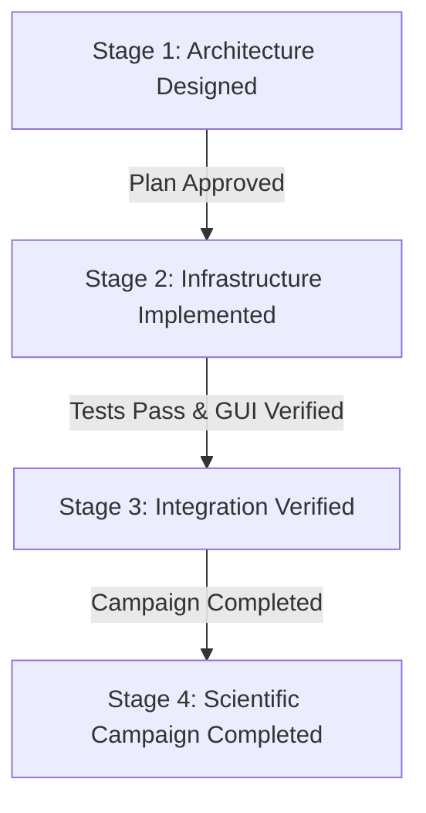

# Project Governance and Maturity Report — GeoAI Platform

This report establishes the four project lifecycle stages, maps campaign maturity states, and assesses the readiness of the Transformer benchmark campaign.

---

## 1. Project Lifecycle Stages Definition

To prevent confusion between code implementation and scientific data collection, the platform governance mandates reporting metrics under four distinct project states:

*   **Stage 1 — Architecture Designed**: The implementation plan detailing models, parameters, interfaces, and evaluation protocols has been formally approved. No code has been executed.
*   **Stage 2 — Infrastructure Implemented**: All wrappers, database schemas, processing scripts, pipeline features, and UI screens have been written. The code compiles.
*   **Stage 3 — Integration Verified**: Unit tests pass cleanly. Database registry inserts function. Mock data verifies that models can be instantiated, trained on dummy grids, and generate prediction outputs.
*   **Stage 4 — Scientific Campaign Completed**: Actual real-world benchmarks have been executed. Cross-AOI metrics have been recorded. Statistical tests (Wilcoxon/McNemar) have been run on real outputs, and findings are backed by measured data.

---

## 2. Campaign Maturity Table

The following matrix tracks the status of all research campaigns across the defined lifecycle stages:

| Campaign ID | Current Lifecycle Status | Stage 1 (Design) | Stage 2 (Infra) | Stage 3 (Verify) | Stage 4 (Science) |
|---|---|:---:|:---:|:---:|:---:|
| **Classical ML Baseline** | **Completed** | ✓ | ✓ | ✓ | ✓ |
| **Boundary Feature Campaign** | **Completed** | ✓ | ✓ | ✓ | ✓ |
| **Transformer CD Campaign** | **Integration Verified** | ✓ | ✓ | ✓ | ✗ |
| **Foundation Models CD** | **Planned** | ✓ | ✗ | ✗ | ✗ |

---

## 3. Transformer Campaign Readiness Assessment

A comprehensive audit of the **Transformer-Based Change Detection Benchmark Campaign** determines the following status:

### A. Implemented Components (Stage 2)
*   **Abstract Wrappers**: `TransformerBaseWrapper` defined to handle attention and embedding extractions.
*   **Architecture Wrappers**: changeformer, bit, tinycd, stanet, and snunet classes registered under `MODEL_REGISTRY`.
*   **Resumption Manifests**: Training epoch checkpoints and state JSON manifests defined in fitting loops.
*   **Comparison Dashboard**: page14 Model Comparison Explorer screen registered in app routing.

### B. Verified Components (Stage 3)
*   **Tests Pass**: All 4 transformer test suites successfully assert model initialization, seed determinism, Query-Key attention hooks extraction, and token maps.
*   **Database Schema**: SQLite tables successfully cascade warnings, errors, and validation checks.

### C. Benchmark Execution & Science Pending (Stage 4)
*   **Pending Benchmark Execution**: Real-world training runs (50 epochs) on LEVIR-CD and OSCD datasets are currently **pending execution**. No real metric variables exist in the registry for these models.
*   **Pending Scientific Analysis**: Statistical validation, Wilcoxon signed-rank tests, and attention overlays are awaiting actual campaign completion.

---

## 4. Publication Readiness Rule
The publication builder (`paper_builder.py`) enforces strict validation controls. A campaign is classified as **"Publication Ready"** only when:
1. SQLite registry reports completed runs for all planned models and seeds.
2. Significance tests (Wilcoxon/McNemar) are logged with non-null p-values.
3. The reproducibility `run_manifest.json` is generated and signed.

Otherwise, the campaign report output is locked and branded as **"Benchmark Pending / Infrastructure Ready"**.
