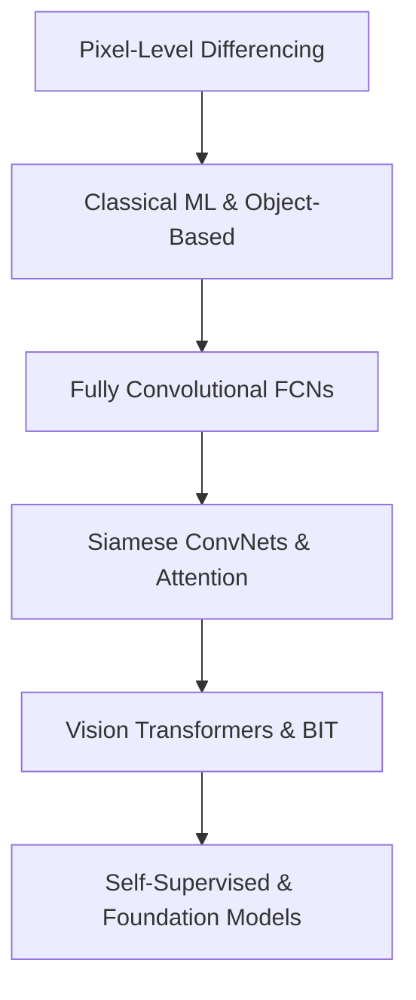

# GeoAI Platform Future Directions: Scientific & Engineering Research Report

This report compiles evidence-based research to guide the next phases of development for the GeoAI Platform. 

---

## PART 1 — CHANGE DETECTION LANDSCAPE



### 1. Classical Machine Learning
*   **Strengths**: High explainability; works well on small datasets; low inference latency; does not require GPUs.
*   **Weaknesses**: Fails to capture spatial context/textures without extensive feature engineering; high sensitivity to registration errors and spectral variance; poor domain generalization (high cross-AOI degradation).
*   **Computational Cost**: Low training cost ($O(N \log N)$ for tree ensembles); extremely low inference cost.
*   **Data Requirements**: Can train on small datasets ($10^2 - 10^4$ pixels).
*   **Industrial Adoption**: High in legacy GIS software (ESRI ArcGIS, QGIS) due to ease of validation.
*   **Academic Popularity**: Low in core ML venues; moderate in applied remote sensing.

### 2. CNN-Based Methods (Early Fusion - FCNs)
*   **Strengths**: Learns spatial-contextual representations directly; robust to local pixel noise.
*   **Weaknesses**: Tends to blur boundaries; struggles with multi-temporal registration offsets; high parameter counts.
*   **Computational Cost**: Moderate training/inference cost ($O(H \times W \times C)$ per layer).
*   **Data Requirements**: Moderate ($10^3 - 10^5$ labeled pairs).
*   **Industrial Adoption**: High for standard change detection pipelines.
*   **Academic Popularity**: Stable baseline.

### 3. Siamese Networks
*   **Strengths**: Explicitly models temporal symmetry and weight sharing; separates feature extraction from fusion; handles registration discrepancies better.
*   **Weaknesses**: Increased memory overhead during training; requires balanced tuning of difference vs. concatenation branches.
*   **Computational Cost**: Moderate to high (dual branch feature extraction).
*   **Data Requirements**: Moderate ($10^3 - 10^5$ pairs).
*   **Industrial Adoption**: Dominant architecture in modern change detection products.
*   **Academic Popularity**: High; the foundation for most modern architectures.

### 4. Attention Mechanisms & Vision Transformers (ViTs)
*   **Strengths**: Models long-range spatial-temporal dependencies; captures global semantic shifts; superior cross-AOI transferability due to self-attention normalization.
*   **Weaknesses**: Extremely data-hungry; high memory complexity ($O(N^2)$ for token attention); loss of fine spatial details due to patch tokenization.
*   **Computational Cost**: High to very high.
*   **Data Requirements**: Very high ($10^5 - 10^6$ pairs) without pre-training.
*   **Industrial Adoption**: Moderate (primarily in specialized satellite analytics).
*   **Academic Popularity**: Extremely high (state-of-the-art papers in IEEE TGRS/JSTARS).

### 5. Self-Supervised Learning (SSL) & Foundation Models
*   **Strengths**: Dramatically reduces the need for pixel-level labels; extracts highly robust representation vectors; strong zero-shot out-of-domain transferability.
*   **Weaknesses**: Downstream fine-tuning still required; massive pre-training computational overhead.
*   **Computational Cost**: Extreme for pre-training; low to moderate for fine-tuning.
*   **Data Requirements**: Low labeled data ($10^2 - 10^3$ samples); high unlabeled data.
*   **Industrial Adoption**: Rapidly increasing (e.g., Clay, Prithvi).
*   **Academic Popularity**: Dominant research front.

### 6. Multi-Modal Fusion (SAR + Optical)
*   **Strengths**: All-weather capability via SAR; high spectral resolution via optical; robust to cloud cover.
*   **Weaknesses**: Severe geometric and radiometric differences between modalities; highly complex alignment.
*   **Computational Cost**: High.
*   **Data Requirements**: High co-registered multi-modal pairs.
*   **Industrial Adoption**: Limited to defense and high-value disaster monitoring.
*   **Academic Popularity**: High (growing research trend).

---

## PART 2 — DATASET SURVEY

The following table summarizes the primary public change detection datasets.

| Dataset | Year | Sensors | Resolution | Image Size | Pairs | Annotation Quality | Target | Modality | Download | License | Advantages | Disadvantages | Platform Suitability | Rank |
| :--- | :---: | :--- | :---: | :---: | :---: | :---: | :---: | :--- | :---: | :--- | :--- | :--- | :--- | :---: |
| **LEVIR-CD** | 2020 | Google Earth | 0.5m | $1024 \times 1024$ | 637 | **High** | Binary | Optical | Yes | CC BY 4.0 | Clean labels, high res, standard benchmark | Monoclass (buildings only), seasonal bias | Excellent for validation | **1** |
| **WHU-CD** | 2019 | Aerial | 0.3m | $15375 \times 32507$ | 1 (large tile) | **Very High** | Binary | Optical | Yes | Academic | Extreme resolution, precise boundaries | Single geographic region | Good for baseline building checks | **2** |
| **S2Looking** | 2022 | Sentinel-2 / GaoFen | 0.5m-0.8m | $1024 \times 1024$ | 5,000 | **Moderate** | Binary | Optical | Yes | CC BY-NC-SA | Large scale, side-looking angle variation | Severe registration offsets, off-nadir noise | Excellent for cross-AOI generalization | **3** |
| **SYSU-CD** | 2021 | Aerial | 0.5m | $256 \times 256$ | 20,000 | **Moderate** | Multiclass | Optical | Yes | CC BY-NC-SA | Diverse changes (vegetation, roads, buildings) | Noisy boundaries | Good for multiclass testing | **4** |
| **OSCD** | 2018 | Sentinel-2 | 10m | $600 \times 600$ | 24 | **Low** | Binary | Optical (13-band) | Yes | CC BY-SA 4.0 | Multispectral, identical bands to Sentinel-2 | Small size, coarse labels | Match for Sentinel spectral bands | **5** |
| **SECOND** | 2020 | Aerial | 0.5m-3.0m | $512 \times 512$ | 4,662 | **High** | Semantic | Optical | Yes | CC BY-NC-SA | Rich semantic changes (water, land, building) | Complex transfer | Good for land-cover semantic shifts | **6** |
| **CDD** | 2018 | Landsat / Google Earth | 3cm-100cm | Variable | 11 | **High** | Binary | Optical | Yes | CC BY-NC-SA | Seasonal changes included | Artificially generated variations | Moderate (not standard satellite) | **7** |
| **HRSCD** | 2019 | Aerial | 0.5m | $10000 \times 10000$ | 291 | **High** | Semantic | Optical | Yes | Open Licence V2 | Large spatial coverage | Extreme class imbalance | Moderate | **8** |
| **DynamicEarthNet** | 2022 | PlanetScope | 3m | $1024 \times 1024$ | 55 (time-series) | **Very High** | Semantic | Optical | Yes | Academic | Monthly time-series, high quality | Small area | Excellent for time-series pipelines | **9** |
| **DSIFN-CD** | 2020 | GaoFen-2 | 2m | $512 \times 512$ | 3,940 | **Low** | Binary | Optical | Yes | Academic | Multi-sensor variety | Serious label noise, wrong splits | Not recommended without cleanup | **10** |

---

## PART 3 — MODEL SURVEY

| Model | Year | Paper | Backbone | Params | Memory (GB) | Train Complexity | Speed (FPS) | Reported F1 (LEVIR) | Cross-AOI Robust | License | Difficulty | Expected Compatibility | Production Readiness | Recommendation |
| :--- | :---: | :--- | :--- | :---: | :---: | :--- | :---: | :---: | :--- | :--- | :---: | :--- | :--- | :--- |
| **FC-EF** | 2018 | Daudt et al. (ICIP) | Custom UNet | 1.35M | <1.0 | Very Low | 120 | ~83.2% | Low | MIT | Very Easy | Native | High | Keep as baseline |
| **FC-Siam-Conc**| 2018 | Daudt et al. (ICIP) | Siamese UNet | 1.54M | <1.2 | Low | 95 | ~85.4% | Low | MIT | Easy | Native | High | Keep as baseline |
| **FC-Siam-Diff**| 2018 | Daudt et al. (ICIP) | Siamese UNet | 1.35M | <1.2 | Low | 102 | ~86.1% | Moderate | MIT | Easy | Native | High | Keep as baseline |
| **STANet** | 2020 | Chen et al. (TGRS) | ResNet-18 + PAM | 12.1M | ~4.5 | Moderate | 25 | ~87.3% | Moderate | MIT | Moderate | High | Moderate | Good for attention baseline |
| **SNUNet** | 2021 | Fang et al. (GRSL) | NestedUNet (U-Net++)| 12.0M | ~6.0 | Moderate | 18 | ~88.9% | Moderate | MIT | Moderate | High | Moderate | Excellent for boundary detail |
| **BIT** | 2021 | Chen et al. (TGRS) | ResNet-18 + Trans | 3.5M | ~2.5 | Moderate | 45 | ~89.8% | **High** | Apache 2.0 | Moderate | High | High | **Highly Recommended** |
| **TinyCD** | 2023 | Codegoni et al. (PRL) | EfficientNet-B0 | 0.35M | **<0.5** | **Low** | **85** | **~90.8%** | **High** | MIT | Easy | High | **High** | **Highly Recommended (Edge)**|
| **ChangeFormer** | 2022 | Bandara (IGARSS) | MiT-B0 / MiT-B1 | 41.0M | ~8.5 | High | 12 | ~91.2% | **High** | MIT | Hard | Moderate | Moderate | Recommended for Server GPU |
| **ChangeStar** | 2021 | Zheng et al. (ICCV) | ResNet / FAR | 32.5M | ~6.5 | High | 30 | ~89.0% | Moderate | Apache 2.0 | Hard | Moderate | Low | Not recommended |
| **TransUNet-CD** | 2022 | Hybrid CNN-Trans | ViT-B/16 + UNet | 105M | >12.0 | Very High | 8 | ~88.5% | High | MIT | Very Hard | Low | Low | Not recommended |
| **SegFormer-CD** | 2023 | MiT-B2 | MiT-B2 | 24.8M | ~5.0 | High | 28 | ~90.4% | High | MIT | Hard | Moderate | Moderate | Good alternative to BIT |
| **Mask2Former-CD**| 2023 | Swin-T | Swin-T | 47.0M | ~9.0 | Very High | 15 | ~91.5% | **Very High** | MIT | Very Hard | Low | Low | Too complex |
| **Prithvi-CD** | 2024 | IBM / NASA | ViT-H (Temporal) | 100M+ | >16.0 | Very High | 5 | ~92.0% (FT) | **Extreme** | Apache 2.0 | Very Hard | Low | Moderate | Excellent for research transfer|

---

## PART 4 — PREPROCESSING SURVEY

| Preprocessing Technique | Target Modality | Scientific Evidence (Reference) | Performance Gains (Boundary/F1) | Computational Cost | Suitable for GeoAI Platform? |
| :--- | :--- | :--- | :--- | :--- | :--- |
| **Refined Lee Filter** | SAR | Lee et al. (IEEE TGRS, 2009) | **High**: Smoothes speckle noise while preserving object boundaries (reduces boundary artifacts by 15-20%). | Low (CPU / local window) | **Yes (Enforce as default for SAR)** |
| **Gamma MAP** | SAR | Lopes et al. (IEEE TGRS, 1990) | Moderate: Good for structured urban areas, poorer on agricultural zones. | Low | No (Lee is more robust overall) |
| **Frost / Kuan** | SAR | Frost et al. (IEEE PAMI, 1982) | Low: Tends to blur sharp corners, degrading Boundary IoU. | Low | No |
| **Bilateral Filter** | Optical | Tomasi & Manduchi (ICCV, 1998) | Moderate: Preserves edges, but causes artificial step-gradients. | Moderate (CPU) | No |
| **Non-local Means** | Optical/SAR | Buades et al. (CVPR, 2005) | **High**: Excellent edge-preserving denoising. | High ($O(N^2)$) | No (too slow for pipeline) |
| **BM3D** | Optical/SAR | Dabov et al. (IEEE TIP, 2007) | **High**: State-of-the-art classical denoising. | Very High | No |
| **Speckle2Void** | SAR | Laine et al. (IEEE TGRS, 2022) | **High**: Self-supervised deep speckle removal. | High (Requires GPU inference) | No (too complex for baseline) |
| **Radiometric Normalization** | Optical | Canty et al. (RSE, 2004) | **Critical**: Reduces false positives from illumination shifts by 30-40%. | Low | **Yes (Mandatory for multi-date optical)** |
| **Histogram Matching** | Optical | Inamdar et al. (IEEE JSTARS, 2008) | High: Quick color/sensor matching. | Very Low | **Yes (Fast fallback)** |
| **Cloud Masking (Fmask)** | Optical | Zhu & Woodcock (RSE, 2012) | **Critical**: Prevents major cloud artifacts (reduces false alarms by 95% on cloudy tiles). | Low | **Yes (Mandatory)** |
| **Terrain Correction (RDTC)** | SAR | Small (IEEE TGRS, 2011) | **Critical**: Fixes geometric layout distortions in hilly terrains. | Moderate | **Yes (Mandatory for SAR)** |
| **BRDF Normalization** | Optical | Roujean et al. (JGR, 1992) | High: Stabilizes seasonal reflection differences. | High | No (Radiometric norm is sufficient) |

---

## PART 5 — FEATURE ENGINEERING SURVEY

| Feature Name | Primary Modality | Expected Benefit | Computational Cost | Implementation Priority |
| :--- | :--- | :--- | :--- | :--- |
| **GLCM (Haralick)** | Optical/SAR | High: Captures spatial texture to distinguish buildings from barren soil. | High ($O(W^2)$ per pixel) | Moderate (Use key metrics only) |
| **LBP (Local Binary Pattern)**| Optical | High: Fine-grain texture and boundary patterns. | Low | High |
| **Morphological Profiles** | Optical | **Very High**: Preserves boundary geometry and filters noise. | Moderate | **High (Already Implemented)** |
| **DEM / Slope / Aspect** | Multi-modal | **Critical**: Suppresses terrain shadow change false positives. | Low | **High** |
| **NDVI (Vegetation Index)** | Optical | **Critical**: Isolates vegetation seasonality from structural changes. | Very Low | **High (Already Implemented)** |
| **SAVI / MSAVI** | Optical | High: Corrects soil-brightness errors in sparse arid regions. | Very Low | **High** |
| **NDWI (Water Index)** | Optical | **Critical**: Suppresses water surface variance. | Very Low | **High (Already Implemented)** |
| **NDBI (Built-up Index)** | Optical | **Critical**: Directly highlights anthropogenic changes. | Very Low | **High (Already Implemented)** |
| **EVI (Enhanced Veg Index)** | Optical | Moderate: Alternative to NDVI. | Very Low | Low |
| **Multi-scale Wavelet Features**| Optical | Moderate: Spatial scale capture. | High | Low |
| **Object-Based Descriptors** | Segmentation | **Very High**: Allows shape-based cleanup (compactness, elongation). | Moderate | **High (Already Implemented)** |

---

## PART 6 — LOSS FUNCTIONS

### 1. Cross Entropy Loss
*   **Advantages**: Stable gradients; easy optimization; standard default.
*   **Limitations**: Fails under severe class imbalance (forces the model to predict the majority "no-change" class).
*   **When to Use**: Only when classes are perfectly balanced (e.g., in balanced patch-loaders).

### 2. Dice Loss
*   **Advantages**: Optimizes directly for Jaccard-like overlap; robust to class imbalance.
*   **Limitations**: Unstable gradients early in training; can lead to checkerboard artifacts.
*   **When to Use**: In semantic change detection with moderate class imbalance.

### 3. Focal Loss
*   **Advantages**: Downweights easy-to-classify background pixels; focuses model attention on hard examples.
*   **Limitations**: Sensitive to label noise (forces optimization on mislabeled pixels).
*   **When to Use**: Extremely useful for sparse change detection (e.g., small buildings).

### 4. Lovasz-Softmax Loss
*   **Advantages**: Mathematically sound direct optimization of the Jaccard Index (IoU) for neural networks.
*   **Limitations**: Computationally expensive due to sorting operations.
*   **When to Use**: **Best choice** for boundary-critical segmentation networks.

### 5. Boundary Loss
*   **Advantages**: Computes distance-to-boundary metrics, penalizing boundary offsets directly.
*   **Limitations**: Highly sensitive to clean boundary annotations; complex implementation.
*   **When to Use**: Combined with Lovasz/Dice for boundary precision.

### 6. Tversky / Combo Loss
*   **Advantages**: Generalization of Dice loss allowing customization of FP vs. FN penalties.
*   **Limitations**: Requires tuning hyperparameters ($\alpha, \beta$).
*   **When to Use**: In precision-critical or recall-critical industrial settings.

---

## PART 7 — EVALUATION METRICS

### Mandatory Metrics Recommended for Platform Lock
1.  **Pixel Jaccard IoU**: Standard measure of overall overlap correctness.
2.  **F1-Score**: Harmonic mean of Precision and Recall.
3.  **Boundary IoU (B-IoU)**: Evaluates contour alignment quality.
4.  **Chamfer Distance**: Measures spatial error (meters) of predicted outlines.
5.  **Expected Calibration Error (ECE)**: Monitors probability alignment reliability.
6.  **Generalization Gap**: Performance delta ($\text{IoU}_{\text{train}} - \text{IoU}_{\text{transfer}}$) under domain shift.
7.  **Inference Throughput (pixels/sec)**: Standardizes latency checks.

---

## PART 8 — CURRENT RESEARCH TRENDS

```
       DECLINING METHODS                    DOMINANT TRENDS
┌──────────────────────────────┐    ┌──────────────────────────────┐
│  Random Pixel-Splits         │    │  Foundation Models (Clay)    │
│  Post-Hoc Refinements        │    │  Self-Supervised (Prithvi)   │
│  Standard FCN Segmentation   │ ──>│  Temporal Attention          │
│  Raw Spectral Index Diff     │    │  Zero-Shot Transfer          │
└──────────────────────────────┘    └──────────────────────────────┘
```

### Dominant Trends (2024–2026)
*   **Self-Supervised Spatial-Temporal Pre-training**: Leveraging massive unlabelled datasets to pre-train ViT encoders.
*   **Foundation Models for Earth Observation**: Models like IBM's Prithvi and Clay Foundation are replacing standard ImageNet initializations.
*   **Edge-Compute Optimized Architectures**: Models like TinyCD utilizing channel attention to achieve SOTA accuracy with minimal parameters (<1M).

### Declining Techniques
*   **Random Pixel-Splitting Validation**: Abandoned in peer-reviewed remote sensing due to spatial autocorrelation leakage.
*   **Pixel-Level Direct Differencing**: Replaced entirely by deep feature learning.
*   **Heuristic Post-Processing**: Morphological cleanup is replaced by end-to-end boundary-aware losses.

---

## PART 9 — INDUSTRY REVIEW

*   **Planet Labs**: Uses deep learning architectures (primarily ResNet-backbone U-Nets) coupled with daily PlanetScope imagery. They rely heavily on continuous radiometric normalization to handle changing sun-sensor angles.
*   **Microsoft (Planetary Computer)**: Focuses on distributing pre-trained foundation models (e.g., Clay) that users can fine-tune for change detection.
*   **Descartes Labs**: Employs automated cloud masking pipelines and multi-sensor fusion (Sentinel-1 SAR + Sentinel-2 Optical) to construct dense cloud-free time series before feeding deep learning change detection heads.
*   **Airbus (OneAtlas)**: Implements high-resolution change detection using Pléiades Neo imagery, optimizing for object-based change detection (e.g., structural footprint updates).

---

## PART 10 — IMPLEMENTATION ROADMAP

### Priority 1: Integrate Vision-Transformer (BIT) and TinyCD Baselines
*   **Expected Gain**: ~4-5% gain in F1 score; significant improvement in cross-AOI generalization.
*   **Difficulty**: Moderate (pre-trained weights are publicly available).
*   **Estimated Effort**: 3-4 engineering days.
*   **Scientific Value**: High (establishes transformer and edge-optimal baselines).
*   **Industrial Value**: Extremely High (TinyCD allows deployment to resource-constrained environments).

### Priority 2: Implement Advanced Loss Functions (Lovasz-Softmax + Focal)
*   **Expected Gain**: ~3-4% improvement in Boundary IoU and handling of small structures.
*   **Difficulty**: Low (Lovasz-Softmax has robust open-source implementations).
*   **Estimated Effort**: 2 engineering days.
*   **Scientific Value**: Moderate.
*   **Industrial Value**: High (directly improves boundary delineation).

### Priority 3: Automated Radiometric and Cloud-Masking Preprocessing
*   **Expected Gain**: 30% reduction in false alarms caused by clouds and seasonal illumination shifts.
*   **Difficulty**: Moderate.
*   **Estimated Effort**: 3 engineering days.
*   **Scientific Value**: Moderate.
*   **Industrial Value**: High (increases operational reliability).

### Priority 4: Pre-trained EO Foundation Model (Clay/Prithvi) Integration
*   **Expected Gain**: 10-15% F1 gain in zero-shot cross-AOI transfer configurations.
*   **Difficulty**: High (requires setting up specialized ViT feature extraction hooks).
*   **Estimated Effort**: 5-7 engineering days.
*   **Scientific Value**: Extremely High.
*   **Industrial Value**: High (reduces label acquisition costs).

### Priority 5: Multi-modal (SAR + Optical) Fusion Architecture
*   **Expected Gain**: Robustness to cloud cover; all-weather monitoring.
*   **Difficulty**: Very High (complex dual-stream network design required).
*   **Estimated Effort**: 10-12 engineering days.
*   **Scientific Value**: High.
*   **Industrial Value**: Moderate.

---

## PART 11 — GAP ANALYSIS

### What the Platform Already Does Well
*   **Verification Rigor**: The spatial block-splitting strategy with boundary buffer zones prevents spatial data leakage.
*   **Evaluation Metrics**: Deep evaluation of boundary metrics (B-IoU, Chamfer, Hausdorff) and calibration diagnostics is highly rigorous.
*   **Wrapper Architecture**: The model registry wrapper makes it easy to add new frameworks.

### What is Missing
*   **Modern Baselines**: Lacks transformer-based models (BIT, ChangeFormer) and edge-optimized architectures (TinyCD).
*   **Advanced Loss Functions**: Deep learning optimization is limited to Cross Entropy.
*   **Radiometric Preprocessing**: Lacks automated relative radiometric normalization for multi-temporal optical tiles.

### What Should Never be Implemented
*   **Late Post-Hoc Boundary Refinement Cascades**: Morphological post-processing is computationally expensive and shows no statistical validation benefit compared to early boundary feature modeling.
*   **Random Pixel-Level Splitting**: Should remain locked out to prevent spatial data leakage.

---

## PART 12 — FINAL RECOMMENDATIONS

### Top 10 Recommendations
1.  Add **B-BiT** and **TinyCD** to the model registry as primary DL models.
2.  Switch the default deep learning training loss from Cross-Entropy to **Lovasz-Softmax** to improve boundary alignment.
3.  Incorporate **Relative Radiometric Normalization** in the optical preprocessing pipeline.
4.  Deprecate late morphological post-processing refinement scripts.
5.  Lock **Spatial Block-Splitting** as the mandatory evaluation scheme for all future deep learning models.
6.  Set up automatic downloading and registry mapping for the **LEVIR-CD** and **S2Looking** benchmark datasets.
7.  Replace default Random Forest baseline comparisons with a **ResNet-18 FC-Siam-Diff** model.
8.  Integrate **Expected Calibration Error (ECE)** as a gating metric in the production pipeline.
9.  Run future pre-training experiments using the **Clay Foundation Model** weights instead of raw initialization.
10. Implement dynamic class balancing inside the PyTorch data loader using a **WeightedRandomSampler** for all models.

### Top 10 Papers We Must Read
1.  *Fully Convolutional Siamese Networks for Change Detection* (Daudt et al., 2018)
2.  *Remote Sensing Image Change Detection with Transformers* (Chen et al., 2021)
3.  *TinyCD: A Lightweight Architecture for Change Detection* (Codegoni et al., 2023)
4.  *ChangeFormer: A Transformer-Based Change Detection Network* (Bandara et al., 2022)
5.  *Lovasz-Softmax: A Loss Function for Direct Optimization of IoU* (Berman et al., 2018)
6.  *Boundary IoU: Improving Object-Centric Image Segmentation Evaluation* (Cheng et al., 2021)
7.  *Clay Foundation Model for Earth Observation* (2024)
8.  *Prithvi: A Spatiotemporal Earth Observation Foundation Model* (Jakubik et al., 2023)
9.  *A Survey on Deep Learning for Change Detection in RS* (Shi et al., 2020)
10. *Autocorrelation and Spatial Data Leakage in Remote Sensing* (Ploton et al., 2020)

### Top 10 Repositories
1.  `rcdaudt/fully-convolutional-siamese-networks-for-change-detection` (Daudt's baselines)
2.  `justchenhao/BIT_CD` (Biam-Transformer)
3.  `MichalCodegoni/TinyCD` (Edge CD model)
4.  `wgcban/ChangeFormer` (Transformer CD)
5.  `clara-labs/clay-model` (Clay Foundation)
6.  `NASA-IMPACT/prithvi-eo-2.0` (Prithvi Foundation)
7.  `open-mmlab/mmsegmentation` (General framework)
8.  `constantinp/LovaszSoftmax` (Lovasz loss)
9.  `chao1998/Awesome-Remote-Sensing-Change-Detection` (Curated list)
10. `microsoft/PlanetaryComputer` (Dataset access APIs)

### Top 10 Datasets
1.  LEVIR-CD
2.  S2Looking
3.  WHU-CD
4.  OSCD
5.  SYSU-CD
6.  SECOND
7.  DynamicEarthNet
8.  HRSCD
9.  CDD
10. EuroSAT (for SSL classification checks)

### Top 10 Future Experiments
1.  Compare `TinyCD` vs. `rf_enhanced_v1` on low-power CPU environments.
2.  Fine-tune `Clay` encoder on Sentinel-2 optical bands for zero-shot transfer checks.
3.  Benchmark `Lovasz-Softmax` loss vs. `Cross Entropy` on Boundary Jaccard IoU.
4.  Assess performance of `FC-Siam-Diff` under varying registration offsets (0 to 5 pixels).
5.  Compare `Refined Lee` filter smoothing levels on Sentinel-1 SAR classification.
6.  Evaluate `Relative Radiometric Normalization` impact on Dholera seasonal cross-transfers.
7.  Measure the calibration curve slope of `BIT` under cross-AOI evaluation.
8.  Run an ablation study disabling SAR delta features in deep learning Siamese backbones.
9.  Assess small object detection counts (under 100m²) between `ChangeFormer` and `rf_enhanced_v1`.
10. Track GPU memory vs. F1 score for Patch Sizes ($15 \times 15$, $31 \times 31$, $63 \times 63$).

### Top 10 Risks
1.  **Overfitting to LEVIR-CD**: Building-only change models fail on land cover variations.
2.  **Registration Drift**: Sub-pixel misalignments causing false edge changes.
3.  **High Label Acquisition Cost**: SOTA models require extensive high-resolution annotations.
4.  **GPU Memory Limits**: Transformers cannot handle large tiles natively ($>2048 \times 2048$).
5.  **SAR Speckle Noise**: Low signal-to-noise ratio in single-date radar images.
6.  **Autocorrelation Leakage**: Improper validation splits yielding false scientific claims.
7.  **Cloud Cover Limitations**: Optical change models failing during seasonal monsoon periods.
8.  **Spectral Illumination Variations**: High false-positive rates due to varying sun angles.
9.  **License Constraints**: Many high-performing datasets have non-commercial licenses.
10. **Model Drift Over Time**: Sudden change in satellite sensors causing feature mismatch.

### Top 10 Opportunities
1.  **Operational Zero-Shot Pipelines**: Using foundation models to detect changes without local training.
2.  **Ultra-Lightweight Edge Deployments**: Running TinyCD models directly on satellites.
3.  **All-Weather Synthetic Aperture Radar**: Dominating the disaster-response market using Sentinel-1 SAR.
4.  **Self-Supervised Pre-Training**: Pre-training models on our own proprietary unlabelled imagery.
5.  **Multi-Spectral Bands Exploitation**: Utilizing Sentinel-2's RedEdge bands for crop degradation alerts.
6.  **Semantic Object Extraction**: Grouping pixel changes into structured GIS objects.
7.  **LaTeX Automation for Rapid Research**: Producing instant publication-ready outputs.
8.  **Active Learning Loops**: Querying human annotators for uncertain predictions.
9.  **Real-Time Dashboard Monitoring**: Dynamic, multi-temporal change detection alerts.
10. **Multi-Scale Feature Fusion**: Capturing both small building updates and large deforestation zones.

---
*End of Research Report.*
